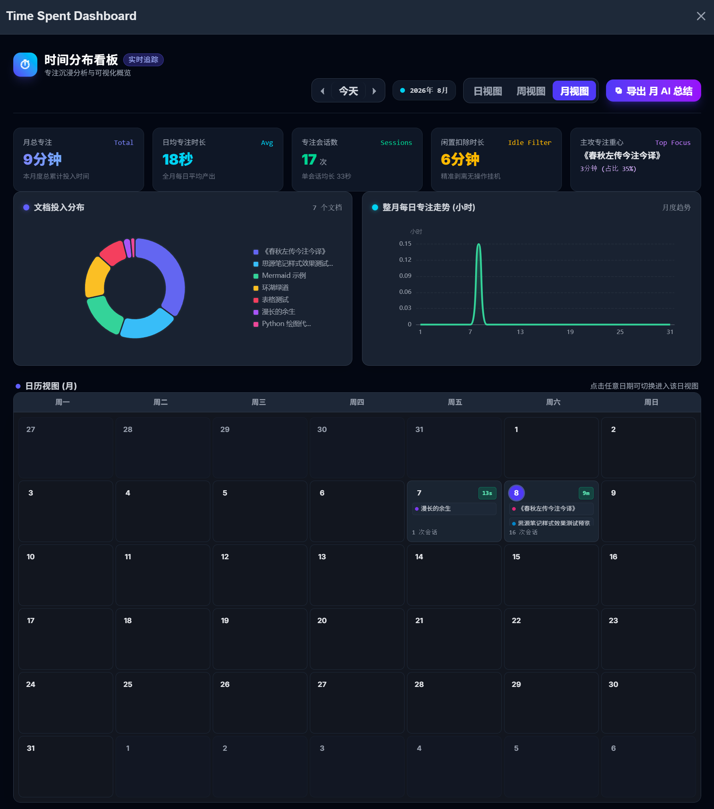

# ⏱️ 思源时间分布与专注分析看板 (Time Spent Dashboard)

> **专为思源笔记（SiYuan）用户打造的全自动时间追踪与深度工作复盘工具。**  
> 告别繁琐的手动打卡，智能识别文档切换，精准剥离闲置挂机，让你的每一分知识沉淀与专注投入都清晰可见。

---

## 💡 为什么需要本插件？（解决的核心痛点）

在日常使用思源笔记进行学习、写作、科研或项目管理时，你是否常遇到以下困扰：

- ❓ **“今天在思源里忙了一整天，但到底在哪篇文档上花了最多时间？”**
- ⏳ **传统时间管理工具（如番茄钟、Toggl 等）需要频繁手动点击开始/结束，极易遗忘且打断心流。**
- 🛋️ **中途离开电脑或把笔记挂在后台，很多统计工具会盲目计时，导致数据严重失真、“假装努力”。**
- 📉 **缺乏周期性统计与直观图表，周末或月末想要复盘时无从下手，更无法有效调整专注节奏。**

**「思源时间分布与专注看板」正是为了解决这些问题而生——无需任何额外操作，它会在后台静默工作，为你提供真实、纯净、立体的个人效能数据。**

---

## 🌟 核心功能与亮点

### 1. 🔄 全自动无感追踪 + 智能防挂机过滤
- **无感记录**：深度融入思源工作流，只要你在阅读或编辑文档，插件便会自动记录对应文档的专注时间；切换文档自动无缝开启新会话，无需手动打卡。
- **智能闲置扣除**：内置用户交互感知机制（实时监测键盘敲击、鼠标移动、页面滚动等）。离开电脑超过设定时间，插件将**精准识别并扣除闲置挂机时长**，确保统计数据 100% 反映真实的深度工作投入。

### 2. 📅 三重视图维度（日 / 周 / 月）全景透视
- **日视图（Day View）**：
  - **24小时纵向时间槽**：清晰展示全天各时段的活动分布与时间块（Time-blocking）。
  - **实时时间红线**：动态指示当前所处时间点，实时感知今日剩余时间。
  - **活动清单**：右侧列表列出当日所有专注会话明细与闲置扣除记录。
- **周视图（Week View）**：
  - **7天对比热力网格**：周一至周日并排对比，一目了然看清一周内在各文档上的时间分布与峰值专注时段。
  - **表头快速下钻**：点击任意一天的日期，可直接下钻查看该日的详细时间槽。
- **月视图（Month View）**：
  - **整月日历矩阵**：以颜色深浅直观呈现整月每日专注强度（轻度投入 / 1小时+ / 3小时+）。
  - **文档标签概览**：在日历格中直观显示当日主攻的重点文档与会话频次。

### 3. 📊 5 大核心 KPI 指标卡 + 交互式可视化图表
看板顶部实时提炼五大关键效能指标：
1. **周期总专注时长**：当前选定周期内的净有效专注时间。
2. **日均 / 峰值专注时长**：评估专注产出与单小时最高投入。
3. **专注会话总数与均长**：了解单次专注深度，判断工作状态是否碎片化。
4. **闲置扣除时长**：清晰呈现剥离的挂机时间，验证数据纯净度。
5. **主攻专注重心与占比**：快速识别投入精力最多的核心文档与百分比。

配合同步联动的 **ECharts 图表**：
- **文档投入分布环形图**：直观展示时间花费在哪些文档/主题上。
- **动态时段分布与走势图**：日视图呈现 24 小时各时段分布柱状图，周视图呈现每日对比柱状图，月视图呈现全月专注走势面积图。

### 4. 🔗 深度双向联动：点击色块直达思源文档
- 看板中的任意时间色块、活动记录或文档名称，均支持**点击直接在思源笔记中打开对应文档**，无缝衔接复习与续写工作。

### 5. 🤖 一键导出 AI 复盘总结 + 专属教练提示词
- 点击看板顶部的 **「导出 AI 总结」** 按钮，一键将当前周期（日/周/月）的结构化统计数据、文档投入表格以及**专门定制的高效能时间教练 Prompt** 复制到剪贴板。
- 直接粘贴至 ChatGPT、Claude 或思源内置 AI 助手，秒级获得个性化的深度工作复盘诊断与优化建议！

### 6. 🔒 100% 本地存储，隐私安全无忧
- 所有统计日志以标准 JSON 格式安全保存在思源工作空间本地目录中。
- 不上传任何数据至第三方服务器，无网络依赖，绝对保障个人笔记隐私与数据安全。

---

## 🎯 典型使用场景

### 场景 1：日常学习与知识沉淀（量化个人成长）
> **“今天我在各个专题上到底学了多久？”**  
> 每天结束学习或工作前，点击顶部栏 ⏱️ 图标打开看板，一眼看清今日在「计算机基础」、「论文阅读」、「考研备考」等不同文档上的净专注时长，避免产生“坐在电脑前一整天却不知学了什么”的虚无感。

### 场景 2：项目推进与内容创作（纠偏碎片化干扰）
> **“我的精力是否真的聚焦在最重要的主线任务上？”**  
> 正在撰写一本书、完成一份关键报告或开发一个项目时，通过「周视图」和「文档投入环形图」，检查核心文档的时间占比是否达到了 60%~80%。若发现大量碎片会话，可及时调整工作策略，减少无效切换。

### 场景 3：周末/月末个人效能深度复盘（AI 智能教练指导）
> **“如何科学优化下周/下月的时间规划？”**  
> 每周末切换至「周视图」或月末切换至「月视图」，点击「导出 AI 总结」，将报告粘贴给 AI。AI 会从时间碎片化程度、核心目标偏离度、专注时段节律等维度进行全方位深度诊断，并提供 3 条切实可行的优化策略。

---

## 🚀 快速上手指南

1. **安装与启用**：
   - 在思源笔记「设置」-「集市」-「插件」中搜索并安装本插件，安装完成后启用插件。
2. **正常使用笔记**：
   - 无需进行任何特殊设置，像往常一样在思源中查阅、记录和编辑文档。插件会在后台全自动、静默地记录你的专注轨迹。
3. **打开数据看板**：
   - 点击思源顶部工具栏的 **⏱️（时钟图标）**，即可呼出全屏「时间分布看板」。
4. **切换视图与日期**：
   - 使用右上角的 **日视图 / 周视图 / 月视图** 标签切换不同粒度；
   - 点击 **上一周期 / 今天 / 下一周期** 自由切换历史日期。
5. **快速下钻与文档直达**：
   - 在周视图或月视图中，点击任意日期可快速下钻至当天的 24 小时时间槽；
   - 点击任意文档记录块，思源将立即跳转并打开该文档。
6. **一键生成 AI 总结**：
   - 点击右上角 **「导出 AI 总结」** 按钮，将结构化数据与提示词复制到剪贴板，发送给 AI 助手进行深度复盘。

---

## 📊 数据存储与性能说明

- **数据位置**：数据以每日独立的 JSON 文件形式（如 `2026-08-08.json`）保存在思源工作空间的数据目录中，轻量且易于备份。
- **性能极佳**：后台追踪仅监听必要的事件，内存占用极低，不影响思源笔记本身的流畅度与打字响应。

---

## 📄 开源许可

本项目基于 [MIT License](./LICENSE) 协议开源。
