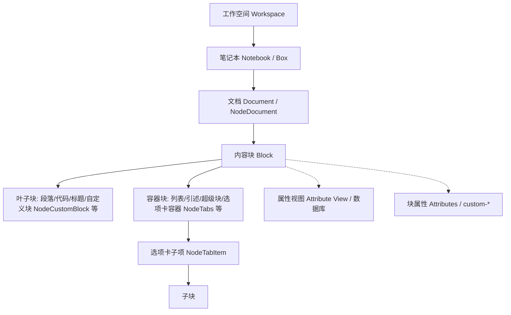

# 关键概念与数据架构速览

- 适用版本：SiYuan `v3.8.3`
- 官方仓库同步到：`siyuan-note/siyuan@master` + Release `v3.8.3`（2026-09-13）
- 最后核对：2026-09-13
- 稳定性：stable
- 权威来源：
  - <https://github.com/siyuan-note/siyuan/blob/master/API_zh_CN.md>
  - <https://github.com/siyuan-note/siyuan/blob/master/kernel/api/router.go>
  - <https://github.com/siyuan-note/siyuan/blob/master/docs/SY-FORMAT.zh-CN.md>
  - <https://github.com/siyuan-note/siyuan/blob/master/docs/TABS.md>

## 1. 数据对象关系（最小心智模型）

- **Notebook（Box）**：笔记本，顶层物理组织目录，包含一组文档。
- **Document（`d` / `NodeDocument`）**：文档块，整篇文档的根节点。
- **Block（内容块）**：思源最小操作粒度。分为容器块（可容纳子块）与叶子块（仅包含行内内容或专用数据）。
- **NodeTabs / NodeTabItem**：v3.8.x 引入的 Spec 3 选项卡容器块，`NodeTabs` 仅容纳 `NodeTabItem`，`NodeTabItem` 容纳正文块。
- **NodeCustomBlock**：v3.8.x 引入的插件自定义叶子块，内容存储在 `.sy` 文件中，由插件 `customBlockRenders` 渲染。
- **Attribute View (AV / 数据库)**：对块及其属性提供多维表格、看板、画廊等结构化视图。

## 2. 核心 SQLite 数据库表

| 表名 | 用途 | 典型开发场景 |
|---|---|---|
| `blocks` | 所有内容块主表 | 按关键词、类型、路径或属性检索内容 |
| `refs` | 引用与双向链接主表 | 统计块引用、构建反向链接图谱 |
| `attributes` | 块属性键值索引表 | 检索带有特定 `custom-*` 标记的块 |
| `assets` | 资源文件（图片、音视频、PDF 等）索引表 | 资源路径反查、清理未使用资源 |
| `spans` | 行内元素索引表 | 检索行内标签（`#tag#`）、超链接或行内标记 |
| `file_annotation_refs` | 附件批注引用表 | PDF 划线高亮与笔记关联 |
| `stat` | 系统统计与数据库版本表 | 校验数据库 schema 版本与同步哈希 |

## 3. ID 与路径字段规范

| 字段 | 语义 | 格式与注意事项 |
|---|---|---|
| `id` | 块 ID | 全局唯一，格式如 `20260913080000-xxxxxxx`，所有 API 的主键 |
| `parent_id` | 父块 ID | 树形结构的上一级块 ID；文档根块的 `parent_id` 为空 |
| `root_id` | 文档根块 ID | 所属文档的块 ID，用于以文档为维度的聚合查询与过滤 |
| `box` | 笔记本 ID | 所属笔记本的标识（通常为 16 进制或时间戳字符串） |
| `path` | 存储路径 | 对应的 `.sy` 文件物理相对路径，如 `/20260913080000-root.sy` |
| `hpath` | 人类可读路径 | 面向用户的目录层级路径，如 `/工作/周报/2026-W37` |
| `ial` | 内联属性列表 | Kramdown IAL 序列化字符串，形如 `{: id="xxx" custom-status="done" }` |

## 4. AV（属性视图 / 数据库）核心概念

| 概念 | 含义 | 说明 |
|---|---|---|
| `avID` | 属性视图唯一标识 | 数据库根标识，对应 `/api/av/*` 系列端点 |
| `viewID` | 视图标识 | 具体视图（表格、看板、画廊等）的 ID |
| `itemID` | 行数据标识（原 rowID） | 每行数据对应的唯一标识，绑定块时等于绑定块的 `id` |
| `keyID` | 列（字段）标识 | 列属性唯一 ID，可通过 `getAttributeViewKeysByAvID` 获取 |
| `cellID` | 单元格标识 | 具体单元格标识，在更新单元格时使用 |
| 富文本列 (`text.rich`) | Kramdown 富文本内容 | v3.8.3 支持在单元格内直接编辑与呈现带格式富文本 |
| 模板列 (`renderTemplate`) | 动态计算显示模板 | 基于变量与表达式动态渲染字段内容 |
| 上下文过滤 (`contextFilter`) | 动态上下文关联过滤 | 通过 `/api/av/setAttrViewContextFilter` 动态注入过滤参数 |

## 5. Agent Capability 与 AI 架构

思源笔记 v3.8.3 将 AI 智能体体系原生内嵌于系统内核：
- 废弃早期实验性的外部独立 MCP 架构，统一由前端/内核插件通过 `addAgentCapability` / `kernel.agent.registerCapability` 注册。
- **能力契约**：声明标准 JSON Schema 输入（`inputSchema`）与输出（`outputSchema`）。
- **副作用声明 (`actionEffects`)**：明确指定读、写、创建、删除、网络等副作用等级，供大模型进行意图理解与安全鉴权。

## 6. 接口与数据层对应原则

| 需求场景 | 首选 API | 数据底层 | 读写限制 |
|---|---|---|---|
| 读写块内容与文档 | `/api/block/*`, `/api/filetree/*` | 内存 AST + `.sy` 文件 | 允许写入，由内核自动同步 SQLite |
| 读写自定义属性 | `/api/attr/*` | 块 IAL + `attributes` 表 | 允许写入，必须使用 `custom-` 前缀 |
| 结构化数据库操作 | `/api/av/*` | AV 专有结构 + `blocks` | 允许写入，推荐批量接口 |
| 文件读写与存储 | `/api/file/*`, 插件 `loadData`/`saveData` | 工作空间文件系统 | 禁止直接用 Node `fs` 改写 `data/` |
| 复杂跨文档检索 | `/api/query/sql` | SQLite 只读连接 | **严禁在 SQL 中执行 INSERT/UPDATE/DELETE** |

## 7. 相关文档导航

- [00-version/SiYuan-v3.8.3开发进展与API迁移指南.md](../00-version/SiYuan-v3.8.3开发进展与API迁移指南.md)
- [04-database-av/数据库表与字段详解.md](../04-database-av/数据库表与字段详解.md)
- [05-block-model/块类型详表-Node与DB映射.md](../05-block-model/块类型详表-Node与DB映射.md)
- [05-block-model/块属性清单与使用建议.md](../05-block-model/块属性清单与使用建议.md)
