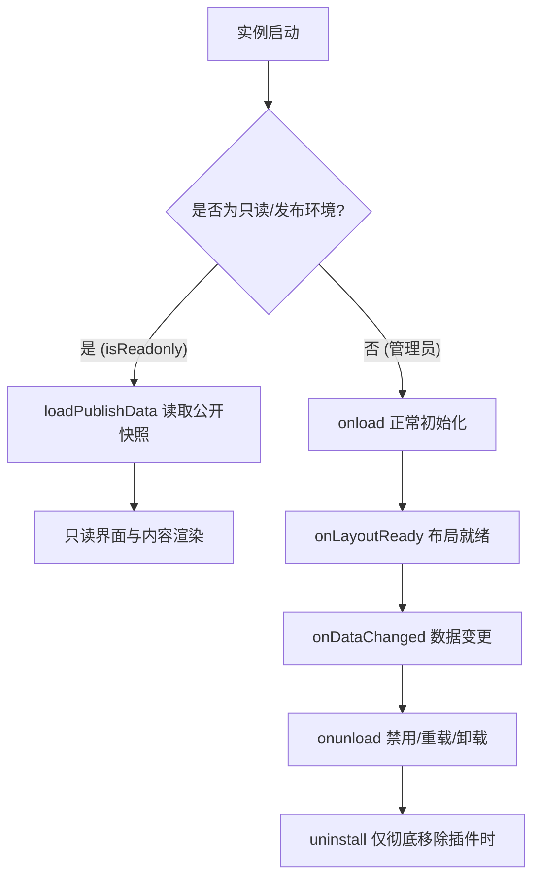

# 插件类与生命周期

- 适用版本：SiYuan `v3.8.5` / `petal v1.2.8`
- 最后核对：2026-09-25
- 稳定性：stable
- 权威来源：
  - <https://github.com/siyuan-note/petal/blob/main/siyuan.d.ts>
  - <https://github.com/siyuan-note/siyuan/blob/master/docs/PLUGIN-PUBLISH.zh-CN.md>
  - <https://github.com/siyuan-note/petal/blob/main/CHANGELOG.md>

## 1. Plugin 完整生命周期契约

思源 v3.8.5 对前端插件生命周期执行**严格串行化、超时保护与只读发布沙箱隔离契约**：



### 1.1 生命周期方法

- **`onload(): Promise<void> | void`**：插件初始化入口。在插件加载时执行，用于注册静态 UI 元素、命令、事件监听与数据加载。
- **`onLayoutReady(): Promise<void> | void`**：界面布局完成钩子。在 `onload` 与内核初始化完成后执行一次，此时主界面 DOM 与各 Dock 已就绪。
- **`onDataChanged(reason?: "sync" | "overwrite"): Promise<void> | void`**：
  - 插件实例就绪后收到数据变更时运行。
  - `reason` 为变更来源：`"sync"` 为跨设备同步合并；`"overwrite"` 为其他前端实例通过文件接口写入。
  - **重要机制**：思源会等待该方法返回的 Promise。若插件**未覆盖**基类实现，数据变更时思源将采取保守策略——**直接重载整个插件实例**。
- **`onunload(): Promise<void> | void`**：插件被禁用、重载或卸载前运行一次。负责注销动态 DOM、移除事件监听、断开长连接。
- **`uninstall(): Promise<void> | void`**：**仅在用户从工作空间彻底移除（删除）插件时**运行一次，在 `onunload` 之后调用。用于清理永久性存储与第三方残留数据。

### 1.2 5 秒共享拆除预算规则

> [!WARNING]
> 当用户执行禁用、重载或卸载时，思源会在首次收到拆除请求时建立一份**共享的 5 秒倒计时预算**：
> 1. 等待未完成的 `onload`、内核初始化、`onLayoutReady` 或正在进行的 `onDataChanged`；
> 2. 执行并等待 `onunload`；
> 3. （若为卸载）执行并等待 `uninstall`。
>
> 这三个阶段**共享同一份 5 秒预算**。尚未开始的 `onDataChanged` 会直接被丢弃。
> 超过 5 秒后，思源不再等待未完成的 Promise，但会尽力调用剩余钩子各一次，随后立即强制拆除宿主挂载的 DOM 与资源。注意：关闭窗口或退出思源进程时不会触发前端卸载钩子。

## 2. 核心实例方法与能力扩充

### 2.1 界面与编辑器挂载

| 方法/属性 | 适用版本 | 语义与作用 |
|---|---|---|
| `addTopBar(options)` | 全版本（**v3.8.5+ 增强**） | 添加顶栏按钮，新增支持 `element`（自定义 DOM）与 `contextMenu`（右键菜单回调） |
| `removeTopBar(id)` | 全版本 | 按 ID 动态移除已注册的顶栏条目 |
| `addStatusBar(options)` | 全版本 | 向底部状态栏添加自定义元素 |
| `addDock(options)` | 全版本 | 注册侧边栏面板（Dock Tab） |
| `removeDock(id)` | 全版本 | 动态移除侧边栏面板 |
| `addToolbarItem(item)` | **v3.8.3+** | **动态向编辑器浮动工具栏添加按钮**，保留用户自定义快捷键 |
| `removeToolbarItem(name)` | **v3.8.3+** | 动态移除编辑器工具栏按钮 |
| `addBreadcrumbButton(options)` | **v3.8.3+** | **在编辑器顶部面包屑区域注册快捷按钮** |
| `removeBreadcrumbButton(id)` | **v3.8.3+** | 动态移除面包屑按钮 |
| `customBlockRenders` | **v3.8.3+** | **自定义块渲染映射表**（渲染 `NodeCustomBlock`，带挂载与清理回调） |

### 2.2 命令与快捷键 (v3.8.5+ 增强)

- `addCommand(options: ICommand)`：注册命令面板命令。
- **多快捷键列表**：新增 `hotkeys?: string[]`（优先于 `hotkey`），支持声明多个默认快捷键组合。
- **条件谓词**：新增 `when?: (context: ICommandContext) => boolean`（可用性判断）与 `enabled?: (context: ICommandContext) => boolean`（启用判断）。
- **统一异步上下文**：支持 `execute?: (context: ICommandContext) => void | Promise<void>`。

### 2.3 密钥与变量管理

- **`getSecret(name: string): string`**：从「设置 → 密钥和变量」的安全密钥库中读取指定名称的密钥明文（内核加密存储，仅本地管理员权限可读）。
- **`getVariable(name: string): string`**：从变量库中读取明文全局变量，用于无敏感风险的配置共享。

### 2.4 数据存储与公开快照 (v3.8.5+ 核心)

- `loadData(storageName: string): Promise<any>`：读取插件本地私有数据（位于工作空间 `data/storage/petal/<plugin-name>/<storageName>`）。
- `saveData(storageName: string, content: any): Promise<any>`：保存私有数据。
- `removeData(storageName: string): Promise<any>`：删除指定存储数据。
- **`loadPublishData(): Promise<Record<string, string | number | boolean | null>>`**：供发布服务访客端读取已获授权的公开快照，未授权(403)或未生成(404)时拒绝 Promise，**严禁回退读取私有数据**。
- **`savePublishData(data: Record<string, string | number | boolean | null>): Promise<void>`**：在管理员端全量更新公开快照，仅支持提交 `plugin.json` 中声明的标量字段。

### 2.5 AI 能力扩展

- `addAgentCapability(options)`：向系统内置 AI Agent 注册前端工具能力，支持指定 `inputSchema`、`outputSchema` 与 `actionEffects`。

## 3. 现代化生命周期完整示例

```ts
import { Plugin, ICommandContext, IProtyle } from "siyuan";

export default class LifecycleDemoPlugin extends Plugin {
  private isCleaningUp = false;

  async onload() {
    console.log("1. 插件启动并初始化...");

    // 注册顶栏按钮
    this.addTopBar({
      id: "demo-topbar",
      icon: "iconInfo",
      title: "生命周期演示",
      callback: () => console.log("顶栏触发"),
    });

    // 注册动态工具栏按钮 (v3.8.3)
    this.addToolbarItem({
      name: "demo-toolbar-tool",
      icon: "iconSparkles",
      title: "插入标记",
      click: (protyle) => {
        console.log("工具栏点击，编辑器:", protyle);
      },
    });

    // 注册面包屑按钮 (v3.8.3)
    this.addBreadcrumbButton({
      id: "demo-breadcrumb-btn",
      icon: "iconRefresh",
      title: "刷新统计",
      callback: (_event: MouseEvent, protyle: IProtyle) => {
        console.log("面包屑触发，文档 ID:", protyle.block.rootID);
      },
    });

    // 注册自定义块渲染器 (v3.8.3)
    this.customBlockRenders = {
      "demo-block": {
        render: ({ element, content, setContent }) => {
          element.innerHTML = `<div class="demo-custom-box">自定义块内容: ${content}</div>`;
          return () => {
            // 清理函数
            element.innerHTML = "";
          };
        },
      },
    };

    // 注册统一上下文命令
    this.addCommand({
      langKey: "runAction",
      hotkey: "⌥⌘A",
      execute: (context: ICommandContext) => {
        console.log("命令触发，当前活动 Protyle:", context.protyle);
      },
    });
  }

  onLayoutReady() {
    console.log("2. 界面布局全部渲染完成，可安全读取 DOM 和 Dock 尺寸");
  }

  async onDataChanged(reason?: "sync" | "overwrite") {
    console.log("3. 收到数据变更事件，变更来源:", reason);
    // 覆盖该方法可避免整插件重载
    await this.refreshPluginCache();
  }

  async onunload() {
    console.log("4. 插件被禁用或重载，开始清理资源...");
    this.isCleaningUp = true;
    this.removeToolbarItem("demo-toolbar-tool");
    this.removeBreadcrumbButton("demo-breadcrumb-btn");
  }

  async uninstall() {
    console.log("5. 插件从工作空间彻底移除，删除本地持久化数据");
    await this.removeData("config.json");
  }

  private async refreshPluginCache() {
    // 模拟轻量刷新
  }
}
```

## 4. 常见避坑要点

1. **务必覆盖 `onDataChanged`**：如果未实现该方法，每次多端同步合并或外部文件修改都会直接导致插件全量 reload，引起界面闪烁。
2. **严守 5 秒拆除预算**：在 `onunload` 与 `uninstall` 中避免无超时限制的网络请求或耗时复杂的重型计算。
3. **顶栏与面包屑 ID 稳定性**：`addToolbarItem` 的 `name`、`addBreadcrumbButton` 的 `id` 应保持静态唯一，以便思源持久化保存用户的自定义位置和快捷键。
4. **只读发布端生命周期保护**：在 `onload` 中通过 `this.isReadonly` 判断只读环境。发布端禁止注册写命令或建立内核双向通信；`onunload` 与 `uninstall` 在只读端应直接返回。
5. **公开数据读取严禁回退**：访客页面调用 `loadPublishData()` 遇到未授权（403）或未生成（404）时，必须提供友好占位或安全默认值，**严禁尝试回退调用 `loadData()`**，否则会导致未授权访问异常或数据泄露风险。
