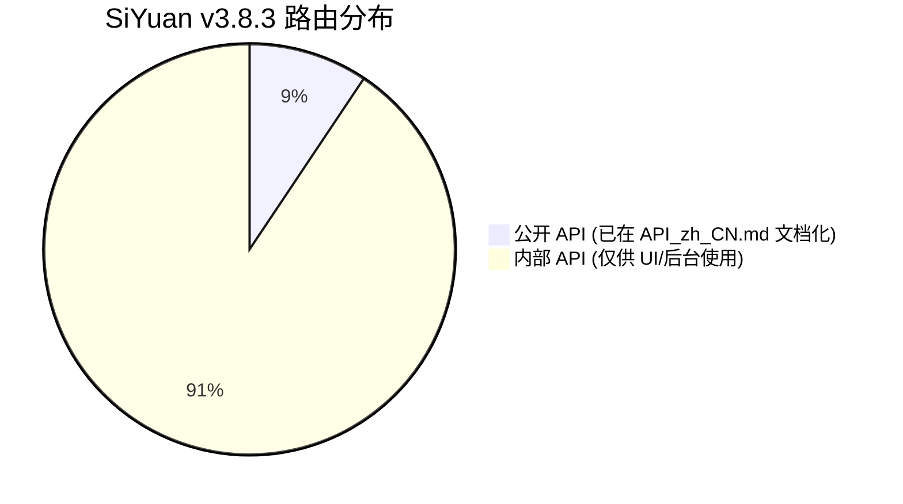

# 非公开 API 与风险说明

- 适用版本：SiYuan `v3.8.3`
- 官方仓库同步到：`siyuan-note/siyuan@master` + Release `v3.8.3`（2026-09-13）
- 最后核对：2026-09-13
- 稳定性：internal
- 权威来源：
  - [official/router.go](official/router.go)
  - [official/API_zh_CN.md](official/API_zh_CN.md)

## 1. 725 路由格局与公私边界

在 SiYuan `v3.8.3` 中，内核通过 `router.go` 注册了 **725 条 HTTP/WebSocket 路由**：



- **公开 API（Public APIs）**：仅包含在官方 `API_zh_CN.md` 文档中的接口（约占总路由的 9%）。官方承诺长周期兼容性，废弃时会提前给出版本迁移周期。
- **内部 API（Internal APIs）**：仅在 `router.go` 注册供内置 UI、移动端、Electron 原生模块或后台同步逻辑使用的端点。此类接口**不承诺任何向后兼容性**，可能在任意次版本中改名、变更字段、变更权限校验甚至直接移除。

## 2. v3.8.3 权限中间件收紧

从 v3.8.x 开始，内核对大量未公开端点增加了更为严格的安全拦截中间件：

1. **`CheckAdminRole`**：
   - 适用于安全敏感接口（如密钥库操作、数据导出、网络代理、云端同步配置、账号令牌等）。
   - 在未开启管理员权限或受限沙箱环境中调用，直接返回鉴权失败。
2. **`CheckReadonly`**：
   - 适用于只读空间或分享会话。
   - 所有具备写入副作用的端点均挂载了只读检查，命中时返回只读保护错误。

## 3. 依赖内部 API 的防御性策略

如果插件业务必须依赖某些未在公开文档中声明的内部端点，必须实施**防御性降级方案**：

```ts
import { fetchSyncPost, showMessage } from "siyuan";

export async function callInternalApiWithFallback<T>(
  primaryEndpoint: string,
  primaryPayload: Record<string, unknown>,
  fallbackAction: () => Promise<T>
): Promise<T> {
  try {
    const res = await fetchSyncPost(primaryEndpoint, primaryPayload);
    if (res.code === 0) {
      return res.data as T;
    }
    console.warn(`[Internal API Warning] ${primaryEndpoint} 失败 (${res.msg})，启用降级策略`);
  } catch (err) {
    console.error(`[Internal API Error] ${primaryEndpoint} 异常:`, err);
  }

  // 降级回退处理
  return await fallbackAction();
}
```

## 4. 检查与发布建议

- **优先公开端点**：凡能通过 `/api/block/*`、`/api/filetree/*`、`/api/attr/*`、`/api/query/sql`、`/api/av/*` 达成的需求，绝不要使用临时内部接口。
- **发版前回归**：每次依赖内部接口的插件在新版思源发布后，必须在全新测试工作空间进行完整回归验证。
- **关注路由风险索引**：随时参考 [07-official-index/router路由变更与风险索引.md](../07-official-index/router路由变更与风险索引.md) 中的风险分级。
