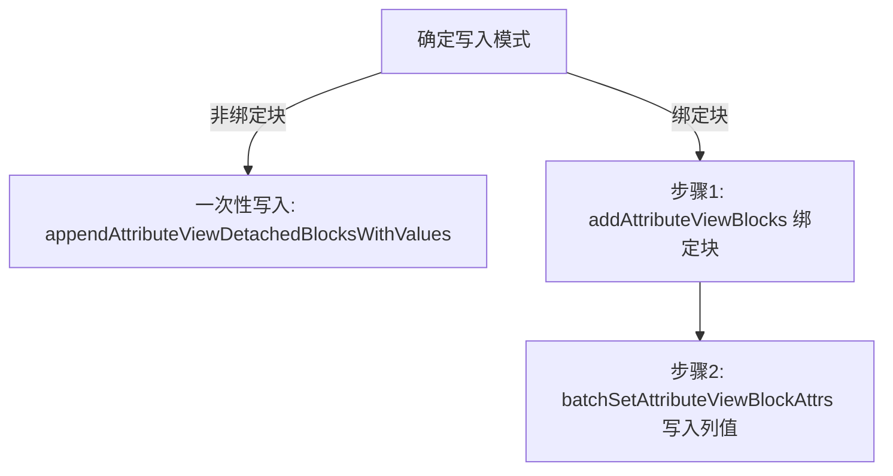

# AV 增删改查与参数模型

- 适用版本：SiYuan `v3.8.5`
- 官方仓库同步到：`siyuan-note/siyuan@master` + Release `v3.8.5`（2026-09-25）
- 最后核对：2026-09-25
- 稳定性：stable
- 权威来源：
  - [../03-kernel-api/official/API_zh_CN.md](../03-kernel-api/official/API_zh_CN.md)
  - [../03-kernel-api/official/router.go](../03-kernel-api/official/router.go)

## 1. AV 核心端点总览

| 端点 | 作用 | 推荐调用时机 |
|---|---|---|
| `/api/av/renderAttributeView` | 查询并渲染属性视图结构 | 读取表格/看板/画廊/日历/列表数据 |
| `/api/av/getAttributeViewKeysByAvID` | 获取属性视图所有列（字段）元数据 | 初始化表头或字段映射 |
| `/api/av/addAttributeViewBlocks` | 为属性视图绑定已有内容块作为行 | 绑定块模式录入 |
| `/api/av/appendAttributeViewDetachedBlocksWithValues` | 新增非绑定块行并附带初始值 | 纯结构化数据快速录入 |
| `/api/av/batchSetAttributeViewBlockAttrs` | **高并发批量设置多行多列值** | 更新数据时的首选接口 |
| `/api/av/removeAttributeViewBlocks` | 移除指定行（解绑或删除） | 删除单行或多行 |
| `/api/av/setAttrViewContextFilter` | 动态设置上下文过滤规则 | 联动查询或动态视图切片 |
| `/api/av/convertDocToAttrView` | 将普通文档转换为属性视图 | 数据迁移与视图升维 |
| `/api/av/convertAttrViewToDoc` | 将属性视图转回普通文档 | 视图降维与纯文本归档 |

## 2. 核心标识与数据层次模型

- **`avID`**：属性视图唯一 ID（整个数据库实例根标识）。
- **`viewID`**：子视图 ID（每个 AV 可以包含多个视图：表格 `table`、画廊 `gallery`、看板 `kanban`、**日历 `calendar` (v3.8.5+)**、**列表 `list` (v3.8.5+)**）。
- **`itemID`**：行唯一标识（原 `rowID`，绑定块时该值等于块 `id`）。
- **`keyID`**：列（字段）唯一标识。
- **`cellID`**：单元格唯一标识。

## 3. 列类型与单元格值模型 (Value Payload)

在 v3.8.3 中，单元格值的结构按列类型严格区分：

| 列类型 (`keyType`) | 数据模型结构 | 示例值 |
|---|---|---|
| 文本 (`text`) | `{ text: { content: string, rich?: string } }` | 支持带 Kramdown 的 `rich` 富文本格式 |
| 数字 (`number`) | `{ number: { content: number } }` | `{ number: { content: 98.5 } }` |
| 单选 (`select`) | `{ select: { content: string } }` | `{ select: { content: "已发布" } }` |
| 多选 (`mSelect`) | `{ mSelect: Array<{ content: string }> }` | `{ mSelect: [{ content: "Vue" }, { content: "TS" }] }` |
| 日期 (`date`) | `{ date: { content: number, isNotEmpty: boolean } }` | `{ date: { content: 1773446400000, isNotEmpty: true } }` |
| 块引用 (`block`) | `{ block: { content: string } }` | `{ block: { content: "20260913080000-xxxx" } }` |
| 复选框 (`checkbox`) | `{ checkbox: { checked: boolean } }` | `{ checkbox: { checked: true } }` |
| URL (`url`) | `{ url: { content: string } }` | `{ url: { content: "https://siyuan-note.com" } }` |
| 电话/邮箱 (`phone`/`email`)| `{ phone: { content: string } }` | `{ phone: { content: "+86..." } }` |

## 4. 增删改查标准操作流程



### 4.1 批量写值标准 Payload

```json
{
  "avID": "20260913080000-av12345",
  "values": [
    {
      "keyID": "20260913080000-keyTitle",
      "itemID": "20260913080000-item1",
      "value": {
        "text": {
          "content": "任务标题（纯文本）",
          "rich": "**任务标题（加粗富文本）**"
        }
      }
    },
    {
      "keyID": "20260913080000-keyStatus",
      "itemID": "20260913080000-item1",
      "value": {
        "select": { "content": "进行中" }
      }
    }
  ]
}
```

## 5. 视图数据归一化适配 (Table vs Gallery vs Kanban)

不同视图类型在 `/api/av/renderAttributeView` 响应中的字段结构有所差异：

```ts
interface IRenderAVResult {
  viewType: "table" | "gallery" | "kanban";
  view: {
    columns?: any[];
    fields?: any[];
    rows?: any[];
    cards?: any[];
    groups?: Array<{ rows?: any[]; cards?: any[] }>;
  };
}

export function normalizeAVItems(res: IRenderAVResult) {
  const { viewType, view } = res;
  const isGallery = viewType === "gallery";

  // 列定义归一化
  const columns = isGallery ? view.fields : view.columns;

  // 行/卡片数据归一化（考虑分组视图）
  let items: any[] = [];
  if (view.groups && view.groups.length > 0) {
    items = view.groups.flatMap(g => (isGallery ? g.cards || [] : g.rows || []));
  } else {
    items = isGallery ? view.cards || [] : view.rows || [];
  }

  return { columns, items };
}
```
