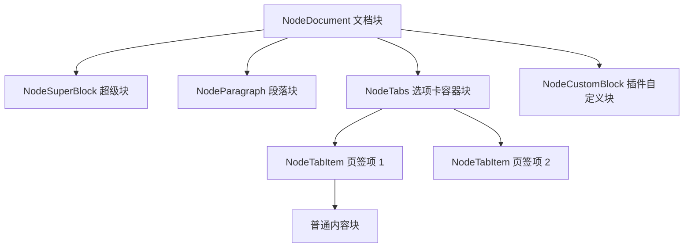

# 块模型与属性规范

- 适用版本：SiYuan `v3.8.5`
- 官方仓库同步到：`siyuan-note/siyuan@master` + Release `v3.8.5`（2026-09-25）
- 最后核对：2026-09-25
- 稳定性：stable
- 权威来源：
  - <https://github.com/siyuan-note/siyuan/blob/master/docs/SY-FORMAT.zh-CN.md>
  - <https://github.com/siyuan-note/siyuan/blob/master/docs/TABS.md>
  - [块类型详表-Node与DB映射.md](块类型详表-Node与DB映射.md)
  - [块属性清单与使用建议.md](块属性清单与使用建议.md)

## 1. 块模型架构（Block Model）

在思源笔记中，文档内容以树状语法树（AST）和结构化块（Block）存储在 `.sy` 文件（底层为 JSON 格式）中，并在运行时映射至 SQLite 关系数据库。



### 1.1 容器块 (Container Blocks)
容器块本身不直接存储正文文本，而是包含一组有序的子块：
- `NodeDocument`（文档根节点）
- `NodeTabs`（**Spec 3 选项卡容器块**，仅能包含 `NodeTabItem`）
- `NodeTabItem`（**选项卡子项**，具有独立的块 ID，容纳普通内容块）
- `NodeCallout`（提示框容器）
- `NodeBlockquote`（引述容器）
- `NodeList` / `NodeListItem`（列表与列表项容器，**v3.8.5 支持切换为可编辑思维导图视图**）
- `NodeSuperBlock`（超级块容器）

### 1.2 叶子块 (Leaf Blocks)
叶子块承载具体的内容或专用渲染数据，不能再包含子块：
- `NodeParagraph`（段落）、`NodeHeading`（标题）、`NodeCodeBlock`（代码块）、`NodeTable`（表格，**v3.8.5 默认支持单元格富文本**）
- `NodeCustomBlock`（**插件自定义块**）：内容由插件的 `customBlockRenders` 渲染，**v3.8.4 起已正式纳入系统 FTS 全文搜索索引**
- `NodeAttributeView`（数据库视图）、`NodeMathBlock`（公式）、`NodeThematicBreak`（分割线）、`NodeIFrame`、`NodeWidget` 等

## 2. 块属性体系（Inline Attribute List, IAL）

每个块都持有一组属性字典，在序列化时以 Kramdown IAL 形式存储在块末尾（如 `{: id="xxx" updated="xxx" custom-flag="true" }`）。

### 2.1 系统属性 (System Attributes)
系统属性由思源内核直接维护和解析，插件只应读取或按业务规范通过 API 修改：
- `id`：块唯一标识。
- `updated`：修改时间戳。
- `name` / `alias` / `memo`：块名称、别名与备注。
- `style`：行内样式（如背景色、字体色）。
- `tabs-active-id`：选项卡容器当前激活的子项 ID。

### 2.2 自定义属性 (Custom Attributes)
- **命名硬性约定**：所有由第三方插件或用户定义的属性**必须使用 `custom-` 前缀**（例如 `custom-myplugin-status`）。未使用该前缀的属性可能会在内核数据整理或同步时被忽略或拒绝。
- **官方内置特性自定义属性**：思源官方内置特性拥有的自定义属性使用 **`custom-sy-`** 前缀（例如思维导图配置属性 `custom-sy-mindmap` 等）。
- **读写方式**：通过 `/api/attr/setBlockAttrs` 写入，通过 `/api/attr/getBlockAttrs` 读取。

```json
{
  "id": "20260913080000-xxxxxxx",
  "attrs": {
    "custom-task-priority": "high",
    "custom-task-reviewer": "alice"
  }
}
```

## 3. 设计与性能准则

1. **状态放属性，正文放块**：业务元数据（如完成标记、关联外键、状态值）存入 `custom-*` 属性；实质性排版文字或长文本存为块的正文内容。
2. **命名空间隔离**：强烈建议自定义属性遵循 `custom-<插件名>-<属性名>` 的命名空间规范，避免不同插件间属性覆盖冲突。
3. **避免大体积 JSON**：IAL 属性每条通常不超过几十到几百字符。切忌将上百 KB 的复杂结构化数据序列化存入单个块属性，过大的 IAL 会严重影响块解析性能；大文件应使用插件持久化接口 `saveData`。
