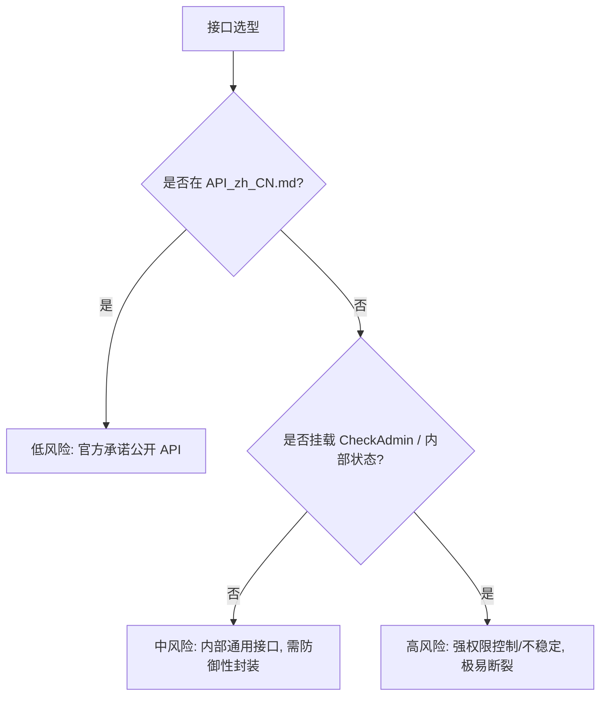

# router 路由变更与风险索引

- 适用版本：SiYuan `v3.8.3`
- 官方仓库同步到：`siyuan-note/siyuan@master` + Release `v3.8.3`（2026-09-13）
- 最后核对：2026-09-13
- 稳定性：internal-risk-index
- 权威来源：
  - [../03-kernel-api/official/router.go](../03-kernel-api/official/router.go)
  - [../03-kernel-api/official/API_zh_CN.md](../03-kernel-api/official/API_zh_CN.md)

## 1. 725 条路由风险分级模型

思源内核截至 v3.8.3 共有 **725 条注册路由**。插件调用时应根据以下三级风险模型评估：



### 1.1 低风险（公开稳定契约，约 68 条）
- **范围**：全量收录于 [官方API全量索引-按模块.md](官方API全量索引-按模块.md) 及 [official/API_zh_CN.md](../03-kernel-api/official/API_zh_CN.md)。
- **特征**：官方承诺跨大版本向后兼容，有正式文档与参数说明。若发生演化会提前发布迁移公告。
- **推荐策略**：优先且无限制依赖。

### 1.2 中风险（未公开但相对稳定，约 350 条）
- **常见模块**：
  - `/api/search/*`（搜索高亮、嵌入块过滤等高级检索）
  - `/api/tag/*`（标签重命名、标签树读取）
  - `/api/history/*`（文档历史快照与 Diff）
  - `/api/bazaar/*`（集市插件与主题元信息拉取）
- **特征**：为桌面端/移动端界面提供数据支撑，长期存在但未入驻公开文档。接口参数偶尔会在次版本随 UI 交互微调。
- **推荐策略**：必须编写 `try/catch` 保护，准备功能回退机制，并在发布日志中注明。

### 1.3 高风险（强权限校验与不稳定内部端点，约 300 条）
- **常见模块与特征**：
  - **管理员特权拦截 (`CheckAdminRole`)**：
    - `/api/account/*`（云端账号凭据）
    - `/api/sync/*`（同步机制内部调度）
    - `/api/cloud/*`（云端存储与凭据）
    - `/api/backup/*`（全量数据库备份与恢复）
    - `/api/secret/*`（安全密钥库直接读写，前端插件应使用 `plugin.getSecret`）
  - **只读拦截 (`CheckReadonly`)**：
    - 所有直接改写文件系统和 SQLite 的内部操作端点。
- **特征**：在只读模式、未授权外部脚本或多用户沙箱环境下会直接抛出 403 / 鉴权拒绝错误。
- **推荐策略**：严禁强依赖。如必须探测，需使用前置权限检查与异常捕获。

## 2. 路由演化与废弃迁移表 (v3.7.x -> v3.8.3)

| 历史/非公开端点 | 现状与评级 | v3.8.3 推荐替代方案 | 说明 |
|---|---|---|---|
| `/api/mcp/*` | **已废弃/移除** | `addAgentCapability` / `kernel.agent.registerCapability` | 废弃早期 MCP 接口，全面迁移至内置原生智能体体系 |
| `/api/filetree/changeSort` | 内部路由 | `/api/filetree/setSort` 或 `/api/filetree/setDocSortMode` | 迁移至公开标准排序接口 |
| 外部脚本直接写 `.sy` | **高危禁用** | `/api/block/updateBlock` 或 `/api/filetree/createDocWithMd` | 直接写磁盘文件会破坏增量索引与协同校验 |
| 前端直连 SQLite 写入 | **内核拒绝** | `/api/attr/setBlockAttrs`、`/api/av/batchSetAttributeViewBlockAttrs` | SQL 接口为只读，数据写入必须走内核 API |

## 3. 防御性调用模板

```ts
import { fetchSyncPost, showMessage } from "siyuan";

export async function invokeSafeApi<T = any>(
  endpoint: string,
  payload: Record<string, unknown>,
  fallbackValue: T
): Promise<T> {
  try {
    const res = await fetchSyncPost(endpoint, payload);
    if (res.code === 0) {
      return res.data as T;
    }
    console.warn(`[API Degradation] 端点 ${endpoint} 返回非零状态: ${res.msg}`);
  } catch (err) {
    console.error(`[API Degradation] 端点 ${endpoint} 异常:`, err);
  }
  return fallbackValue;
}
```
