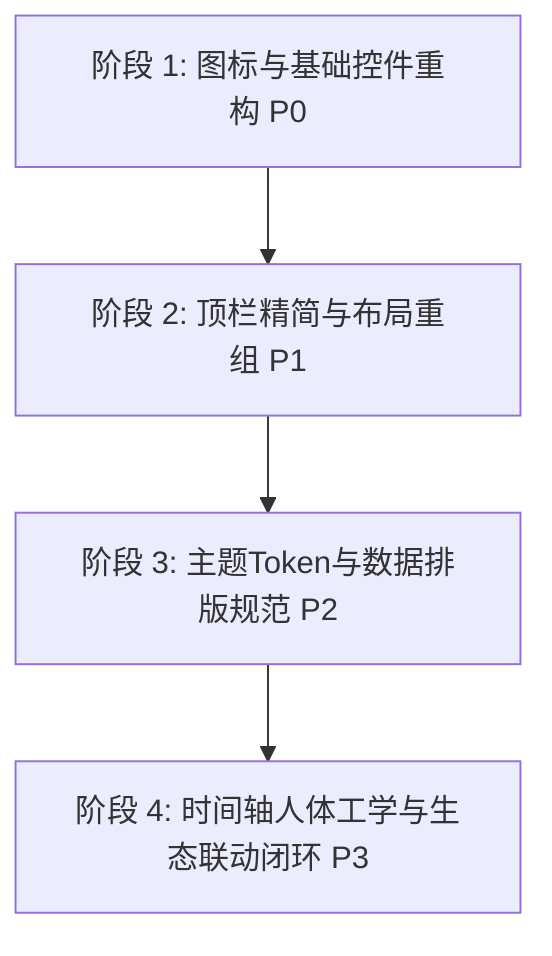

# 源时记 (SiYuan Time Spent) UI/UX 专业级重构与设计优化方案

> **评审角色**：资深互联网应用产品 UX 设计师 / 前端设计系统架构师  
> **执行依据**：`ui-ux-pro-max` 权威设计系统规范（WCAG 2.2、Apple HIG、Google Material Design 3）  
> **文档定位**：指导“源时记”从“工程师可用原型”跃迁至“商业级精致工具”的完整设计与交互优化指南  
> **更新日期**：2026-09-19

---

## 一、前言与设计审计总览 (Executive Summary)

“源时记 (SiYuan Time Spent)”在功能闭环上已经具备极高的实用价值：全自动文档追踪、无感闲置扣除、24 小时活动槽渲染、多维 ECharts 统计以及大模型深度工作复盘，构成了知识工作者强大的个人效能仪表盘。

然而，以成熟互联网桌面生产力工具（如 Notion、Linear、Raycast、TickTick）的 UX 标准来审视，当前版本仍带有明显的**“工程师原型态”痕迹**。核心矛盾集中在：**硬编码深色主题与宿主生态割裂、信息过度平铺导致的三重滚动条嵌套陷阱、操作按钮依赖粗糙的原生 title 属性、随意混用 Emoji、极小字号与低对比度导致的认知疲劳**。

### 综合审计评分卡 (Design Audit Scorecard)

| 维度 | 当前评分 (1-10) | 现状诊断 | 目标愿景 | 优先级 |
| :--- | :---: | :--- | :--- | :---: |
| **可访问性与对比度 (A11y)** | 5.0 | 存在 `<11px` 微文字；部分灰字对比度仅 3.5:1；缺乏 `focus-visible` 键盘状态 | 全面达到 WCAG 2.1 AA (4.5:1)；字号底线 12px；完善键盘焦点导航 | **P0** |
| **图标与控制按钮 (Icons & Actions)** | 4.5 | 滥用 Emoji (🎯/✓/✅)；操作按钮文案繁重；依赖原生延迟 1s 的 `title` 提示 | 全面矢量化；落地 **“直观图标 + 即时精致 Tooltip”** 交互体系 | **P0** |
| **布局与信息架构 (Layout & IA)** | 5.5 | 纵向平铺 6 层容器导致外层与内层产生 3 处滚动条竞争；首屏认知负荷过重 | 模块化网格/Tab 收敛，消除滚动条嵌套，实现所见即所得的自适应视口 | **P1** |
| **排版与数字呈现 (Typography)** | 5.0 | 未启用 `tabular-nums` 等宽数字，动态刷新跳动；中西文混排缺乏字体栈优化 | Fira Code / Inter 协同字体栈；时间与指标数字绝对稳定对齐 | **P1** |
| **色彩与主题协同 (Theme & Color)** | 6.0 | 强制写死深灰黑色 (`bg-gray-950`)，浅色主题用户极度割裂；缺乏设计语义 Token | 深度桥接思源笔记原生 CSS 变量 (`--b3-theme-*`)，支持暗黑/明亮无缝自适应 | **P2** |
| **交互人体工学 (Ergonomics)** | 5.5 | 24小时轴默认停留在空旷的 00:00；日历与清单列表无联动；缺少看板内设置/导出闭环 | 智能聚焦活跃时段；列表与时间块双向悬停高亮；AI 一键沉淀为思源文档 | **P2** |

---

## 二、当前 UI / UX 核心痛点与反模式深度诊断 (Anti-Patterns Audit)

### 2.1 痛点一：双轨制割裂 —— 强制硬编码黑夜模式 vs 思源生态主题

* **代码现状**：
  在 `src/App.vue`（第 3 行）及 `src/components/Dashboard.vue`（第 2 行）中直接硬编码：
  ```html
  <div class="dashboard-modal-container bg-gray-950 border border-gray-800 ...">
  ```
* **用户体验灾难**：
  * 思源笔记拥有海量的社区明亮/浅色主题（如经典浅色、纸质白、各类高亮排版主题）。当浅色主题用户通过顶栏图标打开源时记时，屏幕瞬间被巨大的纯黑悬浮层（`rgba(0,0,0,0.65)` + `bg-gray-950`）笼罩，形成剧烈的**“视觉视网膜轰击”与心理割裂感**。
  * 插件在代码中没有抽象任何与主题相关的 CSS 变量系统，所有卡片背景、文字颜色、边框颜色全部由 Tailwind 的 `gray-900`、`gray-800` 等静态原子类写死。

---

### 2.2 痛点二：布局高度爆炸与“三重嵌套滚动条”陷阱 (Nested Scroll Traps)

* **代码现状**：
  * 弹窗容器（`App.vue`）：`height: 90vh; max-width: 1320px;`（1080p 屏幕下高度通常约 850px-900px）。
  * 纵向排列了以下 6 大板块：
    1. 顶栏品牌区与关闭按钮（~60px）
    2. 专注目标卡片与 5 个快捷候选药丸（~85px）
    3. 周期翻页器 + 日/周/月切换胶囊 + AI 总结按钮（~50px）
    4. 5 张 KPI 统计指标卡（~115px）
    5. 2 张 ECharts 图表卡片（~240px）
    6. 主日历组件 `CalendarView.vue`，内部居然硬编码了 `h-[680px]`！
  * **累计物理高度已达到 1230px**。
* **用户体验灾难**：
  * **第一层**：外层 Modal 容器因为内容超标必须产生纵向滚动条；
  * **第二层**：日历组件内部的 24 小时网格（高度为 $24 \times 56\text{px} = 1344\text{px}$）拥有独立的 `overflow-y-auto` 滚动条；
  * **第三层**：日视图右侧的“今日活动清单”又拥有独立的 `overflow-y-auto` 滚动条！
  * **滚动竞争后果**：当用户的鼠标光标悬停在日历或清单上方滑动滚轮时，页面经常卡在局部滚动区域，无法顺畅滑到底部；触摸板手势在不同区域反复陷入“滚动死锁”，极其令人沮丧。

---

### 2.3 痛点三：操作按钮笨重冗长，过度依赖原生 `title` 属性

* **代码现状**：
  在 `Dashboard.vue` 和 `CalendarView.vue` 中，大量操作按钮采用纯文字或简陋 SVG，提示全部使用原生 `title`：
  ```html
  <button @click="navigatePeriod(-1)" title="上一周期">...</button>
  <button @click="jumpToToday" :title="`跳转至当前...`">今日</button>
  <button @click="switchMode('day')">日视图</button>
  <button @click="switchMode('week')">周视图</button>
  <button @click="switchMode('month')">月视图</button>
  ```
* **用户体验灾难**：
  * **1. 原生 `title` 的迟钝感**：操作系统和浏览器的原生 title 存在 **700ms ~ 1500ms 的长延迟**，样式是操作系统灰底或黄底的小框，不支持富文本、不支持键盘聚焦激活、不支持指示快捷键；
  * **2. 顶栏空间浪费**：“日视图 / 周视图 / 月视图”三个长文字占据了宝贵的右侧横向空间；
  * **3. 关键高频操作入口缺失**：用户在看板内无法直接打开【插件设置】、无法【强制刷新/重新加载数据】、无法【导出 CSV/数据备份】、无法【切换全屏/独立弹窗】。如果用户需要修改闲置检测时长或 AI 模型，必须关闭看板，退出到思源系统的庞大设置菜单中慢慢查找，操作链路直接被切断！

---

### 2.4 痛点四：Emoji 作为结构化功能图示的原型态残留

* **代码现状**：
  * `Dashboard.vue` 第 46 行：`<span>🎯</span> 专注目标`
  * `Dashboard.vue` 第 76 行：`<span>✓ 已保存</span>`
  * `AiSummaryModal.vue` 第 33 行：`🎯 目标：...`
  * `AiSummaryModal.vue` 第 139 行：`{{ copySuccess ? '✅ 已复制' : '复制总结' }}`
* **设计规范违背**：
  * `ui-ux-pro-max` 黄金法则明确指出：**“No Emoji as Structural Icons (禁止将 Emoji 作为结构化功能图标)”**。
  * Emoji 在 Windows 10/11、macOS 和 Linux 系统下颜色、投影、字形和尺寸千差万别；在高 DPI 渲染下往往模糊或失真，给用户带来极其廉价、未经推敲的个人自制软件即视感。结构化位置必须统一使用矢量 SVG（如 Lucide / Phosphor）。

---

### 2.5 痛点五：排版字阶失控与微文字蔓延 (Micro-text Failure)

* **代码现状**：
  在 `CalendarView.vue` 和 `Dashboard.vue` 中充斥着非标准微小字号：
  * `text-[9px]`（行 158、214）
  * `text-[10px]`（行 46、114、198、206）
  * `text-[11px]`（行 81、86、180、208、222、236 等多达数十处）
* **用户体验灾难**：
  * 现代显示屏标准中，普通屏幕上的 9px/10px 在不缩放下几乎无法辨认，严重违反 WCAG 2.1 AA 可读性标准；
  * KPI 卡片内的辅助说明（如“单会话均长”、“精准剥离无操作挂机”）使用了 `text-[11px] text-gray-500`，在 `bg-gray-900` 上的对比度只有约 **3.5:1**（低于法定 4.5:1），对暗光环境和弱视用户极不友好；
  * 数据面板中的时间字符串（`12:45`、`1小时 25分钟`）未启用等宽字体和 `font-variant-numeric: tabular-nums`，导致实时计时器或切换日期时，文字宽度不断抖动抽搐。

---

### 2.6 痛点六：时间轴人体工学缺陷与业务孤岛

* **代码现状**：
  * 24 小时轴（`00:00 - 24:00`）总高度达 1344px，组件加载后默认停在 `top: 0px`（即凌晨 00:00 - 06:00）。
* **用户体验灾难**：
  * 知识工作者白天的核心活跃时间是 `08:30 - 23:00`。打开日历后，用户第一眼看到的是一片空荡荡的深宵网格，必须每次都费力地向下滚动几百像素才能找到当天的第一条活动块；
  * **联动缺失**：右侧的“今日活动清单”与左侧的“24小时时间网格”毫无交互关系。悬停右侧某篇文档，左侧色块毫无高亮反馈，无法快速定位时间块在一天中的物理位置；
  * **思源生态价值断裂**：AI 生成的高价值复盘周报，仅仅提供了一个“复制到剪贴板”按钮，没有提供**“一键插入为今日日记文档 (Daily Note)”**或**“保存为独立时间复盘笔记本文档”**的能力，让用户自己去寻找粘贴位置，错失了插件在思源笔记中最大的生产力红利。

---

## 三、全新设计系统与视觉规范 (Design System & Visual Tokens)

为了彻底根治上述问题，制定以下专业级设计系统蓝图。

### 3.1 颜色系统：语义化 Token 与宿主生态双模桥接

设计系统采用三层 Token 架构：**Primitives (基准色) $\rightarrow$ Semantic Tokens (语义 Token) $\rightarrow$ Component Tokens (组件 Token)**。

```css
/* 设计语义 Token 定义（自动适配宿主浅色/深色主题） */
:root {
  /* 基础表面与背景 */
  --st-surface-overlay: rgba(15, 23, 42, 0.45);
  --st-surface-backdrop-blur: 12px;
  --st-bg-base: var(--b3-theme-background, #ffffff);
  --st-bg-surface: var(--b3-theme-surface, #f8fafc);
  --st-bg-elevated: var(--b3-theme-surface-lighter, #ffffff);
  --st-bg-subtle: #f1f5f9;
  
  /* 文本与对比度 (WCAG AAA / AA 标准) */
  --st-text-primary: var(--b3-theme-on-background, #0f172a);
  --st-text-secondary: var(--b3-theme-on-surface, #475569);
  --st-text-tertiary: #94a3b8;
  --st-text-disabled: #cbd5e1;

  /* 边框与分割线 */
  --st-border-subtle: var(--b3-border-color, #e2e8f0);
  --st-border-strong: #cbd5e1;

  /* 品牌主色 (沉稳 Indigo / 极光紫) */
  --st-primary: #6366f1;
  --st-primary-hover: #4f46e5;
  --st-primary-subtle: rgba(99, 102, 241, 0.08);

  /* 状态指示色 */
  --st-success: #10b981;
  --st-warning: #f59e0b;
  --st-danger: #ef4444;
  --st-info: #06b6d4;

  /* 交互与焦点环 */
  --st-focus-ring: rgba(99, 102, 241, 0.4);
}

/* 深色模式 / 思源原生暗黑模式时自适应 */
[data-theme-mode="dark"],
.theme--dark,
.mode-dark {
  --st-surface-overlay: rgba(0, 0, 0, 0.72);
  --st-bg-base: var(--b3-theme-background, #090d16);
  --st-bg-surface: var(--b3-theme-surface, #111827);
  --st-bg-elevated: var(--b3-theme-surface-lighter, #1a2234);
  --st-bg-subtle: #1e293b;

  --st-text-primary: #f8fafc;
  --st-text-secondary: #cbd5e1;
  --st-text-tertiary: #94a3b8;
  --st-text-disabled: #64748b;

  --st-border-subtle: rgba(255, 255, 255, 0.08);
  --st-border-strong: rgba(255, 255, 255, 0.16);

  --st-primary-subtle: rgba(99, 102, 241, 0.16);
}
```

#### 文档色块算法升级 (Harmonious Morandi Palette)
弃用随意的原色哈希，采用精心校准的**中明度、低饱和度莫兰迪色系（8色）**，确保在深色模式下柔和不刺眼，在浅色模式下文字对比度满足 4.5:1：

```typescript
export const MORANDI_DOC_PALETTE = [
  { bg: '#6366f1', text: '#ffffff', label: 'Indigo (研究课题)' },
  { bg: '#0284c7', text: '#ffffff', label: 'Sky (技术文档)' },
  { bg: '#0d9488', text: '#ffffff', label: 'Teal (工程开发)' },
  { bg: '#059669', text: '#ffffff', label: 'Emerald (知识归纳)' },
  { bg: '#d97706', text: '#ffffff', label: 'Amber (日常记录)' },
  { bg: '#e11d48', text: '#ffffff', label: 'Rose (重难点突破)' },
  { bg: '#7c3aed', text: '#ffffff', label: 'Violet (创意构思)' },
  { bg: '#475569', text: '#ffffff', label: 'Slate (归档杂项)' },
];
```

---

### 3.2 排版与数字工程体系 (Typography & Tabular Numerals)

* **字体栈 (Font Stack)**：
  ```css
  /* 基础文本栈 */
  font-family: -apple-system, BlinkMacSystemFont, "Segoe UI", "PingFang SC", "Hiragino Sans GB", "Microsoft YaHei", "Inter", sans-serif;
  
  /* 数据与时间专用数字等宽类 */
  .font-tabular {
    font-family: "JetBrains Mono", "Fira Code", ui-monospace, SFMono-Regular, monospace;
    font-variant-numeric: tabular-nums;
    letter-spacing: -0.02em;
  }
  ```

* **字阶与行高规范（严禁低于 12px）**：

| 标号 | 对应 Tailwind 类 | 像素尺寸 | 行高 | 适用场景 |
| :--- | :--- | :--- | :--- | :--- |
| **Hero Title** | `text-2xl` | 24px | 32px | 弹窗顶部主标题“源时记” |
| **Section Title** | `text-base font-semibold` | 16px | 24px | 卡片分组标题、模态框标题 |
| **KPI Value** | `text-2xl font-bold font-tabular` | 24px | 28px | 统计数字大字号展示 |
| **Body Regular** | `text-sm font-normal` | 14px | 20px | 列表标题、正文文本、输入框 |
| **Secondary Text** | `text-xs font-normal` | 12px | 16px | 状态副标题、时段刻度、辅助文本 |
| **Badge / Caption** | `text-[12px] font-medium` | 12px | 16px | 标签胶囊、时段角标（**全系统最低字阶限度**） |

---

### 3.3 规范图标体系 (Universal SVG Iconography)

全系统统一引入现代工程图标规范（基于 Lucide 风格 24x24 栅格，统一 1.75px 描边）：

* **严禁行为**：严禁在功能控件中插入 Emoji 表情符号；
* **图标规范一览表**：

| 功能操作 | 推荐 Lucide 图标名 | 语义角色 | 替代当前不规范元素 |
| :--- | :--- | :--- | :--- |
| 专注目标 | `Target` | 目标设定入口 | 替代 Emoji 🎯 |
| 清空输入 | `XCircle` | 消除输入字段 | 替代细线 X 按钮 |
| 保存反馈 | `Check` | 操作成功微动效 | 替代纯文本 `✓` |
| 复制成功 | `CheckCheck` | 剪贴板复制成功 | 替代 Emoji `✅` |
| 日/周/月视图 | `CalendarDay` / `CalendarRange` / `CalendarDays` | 视图模式切换 | 替代纯文字日/周/月按钮 |
| 周期切换 | `ChevronLeft` / `ChevronRight` | 前后周期翻页 | 替代不规则 SVG |
| 回到今天 | `CalendarClock` | 回到当前周期 | 替代文字“今日/本周/本月” |
| AI 深度复盘 | `Sparkles` | 智能分析生成 | 替代闪电图标 |
| 插件设置 | `Settings2` | 直接进入参数配置 | **全新增补高频入口** |
| 刷新数据 | `RotateCw` | 重新拉取本地数据库 | **全新增补高频入口** |
| 导出报表 | `Download` | 导出 Markdown/CSV | **全新增补高频入口** |
| 关闭看板 | `X` | 退出弹窗 | 替代普通细线 cross |

---

## 四、“直观图标 + 即时精致 Tooltip”交互体系重构

用户诉求核心点：**“操作按钮尽量采用直观图标+tooltip方式呈现”**。这不仅能极大幅度节省横向布局空间，还能大幅提升界面的现代科技感和专业质感。

### 4.1 通用组件设计：`SyTooltip` 与 `SyIconButton`

必须将零散的内联按钮重构成两款高度复用、体验极致的基础组件：

#### 组件 1：`SyTooltip.vue`（即时悬停气泡）
* **交互特性**：
  * **智能延迟响应**：进入延迟仅 **120ms**（快速感知但避免鼠标划过时的误触发闪烁），离开延迟 **80ms**；
  * **键盘聚焦支持**：当用户使用 `Tab` 键聚焦在按钮上时，立即触发 Tooltip（满足 WCAG 2.1 Focus Visible 要求）；
  * **支持快捷键提示**：右侧内置 `<kbd class="shortcut">` 胶囊（如 `Alt + ←`、`Esc`、`Ctrl + Enter`）；
  * **避让算法**：支持 `top`、`bottom`、`left`、`right` 自动边界检测，防止被视口边缘裁切。

```html
<!-- 使用示例 -->
<SyTooltip content="切换至日视图" shortcut="1" placement="bottom">
  <SyIconButton icon="CalendarDay" :active="mode === 'day'" @click="switchMode('day')" />
</SyTooltip>
```

#### 组件 2：`SyIconButton.vue`（多态直观图标按钮）
* **规格矩阵**：
  * **尺寸档位**：
    * `sm`: 28×28px (图标 14px) - 适用于内部表格行或微型工具条
    * `md`: 34×34px (图标 16px) - **默认标准操控档位**
    * `lg`: 40×40px (图标 20px) - 顶栏主要操作档位
  * **触觉反馈 (Micro-interactions)**：
    * `hover`: 背景微泛白光/浮现微浅底色，平滑过渡（`transition: all 150ms cubic-bezier(0.4, 0, 0.2, 1)`）；
    * `active`: 整体轻微下沉缩放（`transform: scale(0.94)`）；
    * `focus-visible`: 显示 2px 环形焦点扩散光晕（`ring-2 ring-indigo-500/50`）。

---

### 4.2 顶栏交互工具条 (Header Action Bar) 重构蓝图

当前臃肿的顶栏通过“图标化 + 分组胶囊化”进行空间收敛，重构后整体高度由原来的 ~135px 缩减至 **52px**，并横向分为四大清晰职能区：

```
+---------------------------------------------------------------------------------------------------------+
| [LOGO] 源时记   | [<] [今天] [>] 2026年9月第38周 | (日)(周)(月) | [✨AI复盘] [🔄刷新] [⚙️设置] [📥导出] [✕关闭] |
+---------------------------------------------------------------------------------------------------------+
```

1. **左侧【品牌与状态区】**：
   * 矢量化品牌图标 + “源时记”字标；
   * 右侧配以微型脉冲呼吸绿点：“正在追踪：当前文档标题”；

2. **中左侧【时钟周期导航组】（集成 Segmented Group）**：
   * `[ChevronLeft 图标]` + Tooltip: `上一周期 (Alt + ←)`
   * `[CalendarClock 图标 + 当前周期文本]` + Tooltip: `点击快速回到当前周/日 (T)`
   * `[ChevronRight 图标]` + Tooltip: `下一周期 (Alt + →)`

3. **中右侧【视图模式切换器】（Segmented Icon Controls）**：
   * 聚合在一个胶囊背景条中，三个并排图标按钮：
     * `[CalendarDay 图标]` + Tooltip: `日视图 · 24小时活动槽 (快捷键: 1)`
     * `[CalendarRange 图标]` + Tooltip: `周视图 · 7日多维对比 (快捷键: 2)`
     * `[CalendarDays 图标]` + Tooltip: `月视图 · 宏观热力图阵 (快捷键: 3)`
   * 带有丝滑的滑动背景指示块（Pill Slider Animation）。

4. **右侧【全局高频动作区】（全图标化，极具极客范）**：
   * `[Sparkles 图标 + 高亮渐变外圈]` + Tooltip: `AI 深度复盘与工作建议 (Ctrl + Enter)`
   * `[RotateCw 图标]` + Tooltip: `重新载入并计算最新时间数据 (R)`
   * `[Download 图标]` + Tooltip: `导出专注日志与报表 (Markdown / CSV)`
   * `[Settings2 图标]` + Tooltip: `打开源时记插件设置 (S)`
   * `[X 图标]` + Tooltip: `关闭看板 (Esc)`

---

## 五、核心视图与信息架构重构方案 (Layout & Information Architecture)

### 5.1 彻底消灭“三重滚动条嵌套”：工作台分区与自适应视口

针对痛点二的高度爆炸问题，必须重构信息层级结构。将界面从无节制的“纵向堆砌”调整为**“紧凑仪表盘 + 沉浸式工作台”的黄金分割布局**。

```
+---------------------------------------------------------------------------------------------------+
| 顶栏工具条：品牌 | 周期导航 | 模式切换(日/周/月) | 全局动作(AI/刷新/设置/导出/关闭)                     | (52px)
+---------------------------------------------------------------------------------------------------+
| 概览折叠抽屉 (Overview Drawer) / KPI 跑马灯状态栏                                                   | (64px)
| [今日专注: 4h 15m] [会话数: 18次] [平均时长: 24m] [闲置扣除: 32m] [重心: 认知心理学] [🎯目标: 推进课题]  |
+---------------------------------------------------------------------------------------------------+
| 主工作台区域 (Flex-1 自适应剩余高度，无外层滚动条！)                                                |
|                                                                                                   |
| +-----------------------------------------------+ +---------------------------------------------+ |
| | 日历主视图 (70% 宽度)                          | | 分析与清单副侧栏 (30% 宽度)                    | |
| |                                               | |                                             | |
| | - 24小时活动槽 (日视图)                         | | - TAB 1: 投入分布环形图 (Donut Chart)        | |
| | - 7日时刻网格 (周视图)                         | | - TAB 2: 时段走势柱状图 (Trend Chart)       | |
| | - 月度热力矩阵 (月视图)                         | | - TAB 3: 今日访问文档序列与跳转清单          | |
| |                                               | |                                             | |
| +-----------------------------------------------+ +---------------------------------------------+ |
+---------------------------------------------------------------------------------------------------+
```

#### 设计革新效益：
1. **外层容器彻底禁用纵向滚动**（`overflow: hidden`），整机永远保持在 90vh 视口内；
2. **左侧核心主日历（70% 宽）**：拥有专属的滚动容器，日历视图拥有更开阔的横向与纵向视口，不再被挤成一小截；
3. **右侧分析与清单（30% 宽）**：通过 Tab 切换或纵向微卡片展示图表与清单，鼠标滚轮在两侧操作时互不干扰，彻底根除滚动条竞争陷阱。

---

### 5.2 专注目标（Focus Goal）的人体工学改良

* **现状问题**：当前目标卡片占用了整整一行空间，且 5 个候选药丸无论是否需要都永久平铺。
* **重构方案 —— 融入紧凑顶部状态栏**：
  * 平常状态下以微型精致徽章展示：`🎯 今日目标：推进认知科学大纲 (已完成 65%)`，点击该徽章平滑展开内联快捷编辑 Popover；
  * 预设候选标签置于 Popover 内部，只在用户有修改意愿时展示，首屏垂直空间立省 **85px**！

---

### 5.3 24 小时时间网格的人体工学升级 (Smart Viewport)

* **智能活跃时段对齐 (Auto-Scroll to Focus Hours)**：
  * 组件挂载完毕后，检测当日（或本周）最早一条记录的起始时间 $T_{\text{start}}$；
  * 如果 $T_{\text{start}}$ 在 08:30，日历滚动条在 300ms 内平滑滚动到 08:00 位置；
  * 若当天尚无记录，默认平滑滚动至当前小时的前一小时（例如当前是 14:00，默认滚动至 13:00），确保红色的“当前时间指示线”处于可视区域正中心；
  * 彻底告别打开页面就是 00:00 一片死寂灰色的糟糕体验！

---

### 5.4 日历色块与清单的双向悬停联动 (Bi-directional Hover Linking)

* **交互细节**：
  * 当鼠标悬停在日视图右侧清单某项（如《Vue3 组件设计指南》）时：
    * 左侧 24 小时轴内属于该文档的所有色块同时产生高亮波纹动效（`ring-2 ring-indigo-400 scale-[1.02] shadow-lg`）；
    * 其他无关色块透明度降为 `opacity-35`；
  * 反之，鼠标悬停在左侧时间槽色块时，右侧列表中对应文档自动高亮并自动微滚入可视区。
  * 用户可以在极短时间内完成对“特定文档分散在一天中哪些碎裂时段”的瞬间视觉辨识。

---

### 5.5 AI 复盘沉淀闭环：一键插入为思源笔记文档

* **功能升级**：
  在 `AiSummaryModal.vue` 底部工具栏中，除了【复制总结】，新增核心生产力按钮：
  * `[BookPlus 图标] 一键沉淀至今日日记`
  * `[FileText 图标] 导出为独立复盘笔记`
* **交互流程**：
  点击后调用思源内核 API（`prependBlock` 或 `createDocWithMd`），直接在用户的思源日记中追加一个排版优美的折叠块（Folded Block）：
  ```markdown
  > ⏱️ **源时记 · 深度工作周报复盘 (2026-W38)**
  > - 总计专注：24小时 30分钟
  > - 核心成果：完成《算法重构》与《架构设计》
  > ...（AI 建议与反思）
  ```
  完成时间记录、可视化看板与知识库复盘的真正生态大闭环！

---

## 六、落地改造路线图与实施优先级 (Implementation Roadmap)

为确保工程落地稳步推进，建议分四个阶段实施：



### 阶段 1 (P0)：图标体系化、SyTooltip & SyIconButton 落地、消除 Emoji
* **耗时预估**：1-2 个迭代日
* **改动点**：
  1. 创建 `src/components/Common/SyTooltip.vue` 与 `src/components/Common/SyIconButton.vue`；
  2. 引入规范的 Lucide / Heroicons 矢量 SVG，全面替换 Dashboard、AiModal、Calendar 中的 Emoji 与原生 HTML `title` 属性；
  3. 顶栏操作按钮统一采用“图标 + Tooltip”呈现。

### 阶段 2 (P1)：消灭嵌套滚动、顶栏紧凑化与看板内功能闭环
* **耗时预估**：2-3 个迭代日
* **改动点**：
  1. 重构 `Dashboard.vue` 栅格布局，将日历与图表调整为左右 7:3 布局，解除外层纵向滚动限制；
  2. 专注目标卡片改造为收敛式状态条；
  3. 在顶栏增设【看板内直接打开设置】、【刷新数据】、【导出报表】入口。

### 阶段 3 (P2)：主题解耦（适配思源原生明暗主题）与数字等宽排版
* **耗时预估**：2 个迭代日
* **改动点**：
  1. 梳理 `src/index.css`，引入 `--st-*` 语义化设计 Token，对接 `--b3-theme-*`；
  2. 去除模板中强制硬编码的 `bg-gray-950`、`border-gray-800` 等原子类，改用语义变量；
  3. KPI 指标和时间轴全面引入 `font-tabular`，彻底根治数字变动引起的排版抖动；
  4. 全系统清理 `<11px` 的微型文字，重塑清晰字阶。

### 阶段 4 (P3)：时间轴智能视口、双向联动与思源文档沉淀
* **耗时预估**：2 个迭代日
* **改动点**：
  1. `CalendarView.vue` 增加挂载后智能平滑滚动至活跃时段算法；
  2. 实现活动列表与日历色块的双向悬停高亮联动（Hover Linking）；
  3. `AiSummaryModal.vue` 实现一键调用思源 API 沉淀至今日日记或新建独立笔记文档。

---

## 七、附录：改造前后关键代码与视觉原型对照 (Before / After)

### 7.1 典型操作按钮改造对照

#### 改造前 (Before: 笨重文本、原生延迟 title、内联 SVG)
```html
<!-- 原代码：文字冗长，占用宽度，原生 title 体验粗糙 -->
<button @click="switchMode('day')" 
        class="h-[26px] px-3.5 flex items-center justify-center text-xs rounded-lg font-medium ...">
  日视图
</button>

<button @click="openAiSummaryModal" 
        class="h-9 px-4 inline-flex items-center gap-1.5 bg-gradient-to-r from-indigo-600 to-purple-600 ...">
  <svg class="w-3.5 h-3.5" fill="none" viewBox="0 0 24 24" stroke="currentColor">...</svg>
  AI 总结
</button>
```

#### 改造后 (After: 直观图标、即时精致 Tooltip、快捷键提示、状态微交互)
```html
<!-- 改造后：图标紧凑，毫秒级响应 Tooltip，快捷键指引，语义清晰 -->
<SyTooltip content="日视图 · 24小时活动槽" shortcut="1" placement="bottom">
  <SyIconButton 
    icon="CalendarDay" 
    :active="calendarMode === 'day'" 
    @click="switchMode('day')" 
    aria-label="切换至日视图"
  />
</SyTooltip>

<SyTooltip content="AI 深度复盘与工作建议" shortcut="Ctrl+Enter" placement="bottom">
  <SyIconButton 
    icon="Sparkles" 
    variant="primary-gradient" 
    @click="openAiSummaryModal" 
    aria-label="AI 深度复盘"
  />
</SyTooltip>
```

---

### 7.2 核心组件规格代码参考 (`SyTooltip.vue`)

```html
<template>
  <div class="relative inline-flex items-center" 
       @mouseenter="handleMouseEnter" 
       @mouseleave="handleMouseLeave"
       @focusin="showTooltip"
       @focusout="hideTooltip">
    <slot />
    
    <Transition name="sy-tooltip-fade">
      <div v-if="isVisible" 
           ref="tooltipRef"
           role="tooltip"
           class="sy-tooltip-content absolute z-50 pointer-events-none px-2.5 py-1 text-xs font-medium text-white bg-gray-900/95 border border-gray-700/80 rounded-lg shadow-xl backdrop-blur-md whitespace-nowrap flex items-center gap-1.5"
           :class="placementClasses">
        <span>{{ content }}</span>
        <kbd v-if="shortcut" class="px-1.5 py-0.2 text-[10px] font-mono text-gray-300 bg-gray-800 border border-gray-600/60 rounded shadow-xs">
          {{ shortcut }}
        </kbd>
      </div>
    </Transition>
  </div>
</template>

<script setup lang="ts">
import { ref, computed } from 'vue';

const props = withDefaults(defineProps<{
  content: string;
  shortcut?: string;
  placement?: 'top' | 'bottom' | 'left' | 'right';
  delay?: number;
}>(), {
  placement: 'bottom',
  delay: 120
});

const isVisible = ref(false);
let timer: ReturnType<typeof setTimeout> | null = null;

const handleMouseEnter = () => {
  timer = setTimeout(() => {
    isVisible.value = true;
  }, props.delay);
};

const handleMouseLeave = () => {
  if (timer) clearTimeout(timer);
  isVisible.value = false;
};

const showTooltip = () => { isVisible.value = true; };
const hideTooltip = () => { isVisible.value = false; };

const placementClasses = computed(() => {
  switch (props.placement) {
    case 'top': return 'bottom-full left-1/2 -translate-x-1/2 mb-1.5';
    case 'left': return 'right-full top-1/2 -translate-y-1/2 mr-1.5';
    case 'right': return 'left-full top-1/2 -translate-y-1/2 ml-1.5';
    default: return 'top-full left-1/2 -translate-x-1/2 mt-1.5';
  }
});
</script>

<style scoped>
.sy-tooltip-fade-enter-active,
.sy-tooltip-fade-leave-active {
  transition: opacity 120ms ease, transform 120ms ease;
}
.sy-tooltip-fade-enter-from,
.sy-tooltip-fade-leave-to {
  opacity: 0;
  transform: scale(0.95) translateY(props.placement === 'bottom' ? -2px : 2px);
}
</style>
```

---

## 八、总结

通过本方案中**“图标+Tooltip”交互体系重构**、**布局消灭嵌套滚动条**、**思源原生主题无缝融合**以及**时间轴人体工学改良**，源时记将彻底摆脱原型阶段的生硬与滞涩，在视觉质感、响应灵敏度与生产力沉浸感上全面迈入专业级生产力工具的行列。
