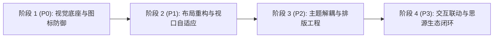

# 源时记 (SiYuan Time Spent) UI/UX 专业级重构与设计优化方案

> **评审角色**：互联网应用资深 UX 设计师 / 桌面生产力工具设计系统架构师  
> **设计哲学**：克制、严谨、无感流转、深耕思源生态；坚决拒绝空洞盲目的“AI Slop”堆砌与伪精致  
> **执行依据**：WCAG 2.2 AA/AAA 规范、Apple Human Interface Guidelines (macOS/Desktop)、思源笔记设计系统规范  
> **文档定位**：指导“源时记”从“工程师功能原型”蜕变为“商业级、高沉浸感知识工作者生产力伴侣”的权威设计与交互指导白皮书  
> **更新日期**：2026-09-25

---

## 一、前言：资深设计师的审计视角与原提案再评估 (Executive Summary & Proposal Review)

“源时记 (SiYuan Time Spent)”在核心算法和业务功能上已具备极高的完成度：基于焦点的文档时间统计、智能闲置剥离、24 小时时间槽映射、多维 ECharts 图表，以及与 API 旋钮联动的大模型复盘，构成了知识工作者极为渴望的深度工作分析闭环。

然而，站在从业多年的互联网桌面应用 UX 资深设计师视角审视当前版本，界面仍带有典型的**“原型期生硬感”**。更重要的是，在审查上一版设计提案时，我们发现其中掺杂了部分**典型的“AI Slop（人工智能胡乱堆砌）”设计倾向**——表面上套用时髦词汇，实则脱离思源笔记真实使用环境、在多视图数据密度下反常识地压缩布局。

### 1.1 对上一版优化提案（2026-09-19 版）的批判性审视与拨乱反正

| 评估维度 | 原提案主张 | 资深 UX 设计师审视意见 | 修正与定调结论 |
| :--- | :--- | :--- | :--- |
| **主题适配** | 提到了深浅色模式，但仅写死两套十六进制色彩 | **浅尝辄止**：思源生态有海量第三方主题（羊皮纸黄、奶白、冷灰、纯黑），写死十六进制色会导致严重色差边缘；且未考虑 ECharts 图表在明暗切换时的文本/网格失真。 | **深度咬合思源原生 CSS 变量**（`--b3-theme-*`、`--b3-border-color`），建立 WCAG 2.2 AA 严格对比度防线，ECharts 具备双模自适应能力。 |
| **布局解耦** | 主张“左侧日历 70% + 右侧图表 30% 并排”，以此消灭滚动条 | **严重 AI Slop 致命缺陷**：完全脱离桌面工作流！在 1320px 弹窗下，70% 仅剩约 850px。日历周视图要容纳 7 天刻度列，每列实际可用宽度不足 100px，文档标题与时间槽直接被压成无法辨识的碎片；日视图本身已有清单侧栏，强行 7:3 并排会变成灾难性的“三栏套娃”。 | **坚决推翻 70/30 机械死板并排！** 确立**“弹性视口驱动信息架构 (Viewport-Driven IA)”**：主日历独享 100% 满血横向空间（日视图左网格右清单，周/月/年视图全景展开）；分析图表收纳为“顶部紧凑跑马灯/分析视图 Tab/日视图按需切换”，彻底消除纵向滚动条的同时保全多日视图的数据密度。 |
| **图标体系** | 主张使用 Lucide SVG 替代 Emoji | **遗漏宿主环境关键致命坑点**：思源笔记全局 CSS 强行给所有内嵌 `<svg>` 注入 `fill: currentColor`。若仅引入常规 SVG，线框图标会被思源样式强制涂成“实心墨团”，视觉瞬间报废！ | **确立“显式线框防御铁律”**：必须在所有 `<svg>` 元素上显式挂载 `style="fill: none !important;"`（或通过 Scoped CSS 强特异性覆盖），统一 24x24 栅格与 1.75px 描边，彻底防御宿主样式污染。 |
| **按钮与 Tooltip** | 主张所有按钮均采用纯图标 + Tooltip | **矫枉过正，陷入神秘肉导航 (Mystery Meat Navigation)**：如果将高频核心模式切换（如日/周/月/年）也全部换成三个长得极其相近的日历小图标，用户每一次切换都必须悬停猜图标，大幅增加认知负荷。 | **推行“分段胶囊控制 + 动作直观图标”的分流准则**：日/周/月/年保持极简分段滑块（Segmented Pill），零猜疑成本；通用工具按钮（AI、刷新、设置、导出、关闭、翻页、今天）全面采用直观线框图标 + 120ms 精致即时 Tooltip。 |

### 1.2 综合审计评分卡 (Design Audit Scorecard)

| 核心维度 | 当前代码现状 | 原提案预期 | 本次刷新修正方案目标 | 优先级 |
| :--- | :---: | :---: | :--- | :---: |
| **宿主协同与色彩 (Theme & A11y)** | 4.0 | 6.0 | **9.5**：全链路桥接思源 `--b3-*` 变量，亮暗模式秒级自适应，文字对比度 $\ge 4.5:1$；莫兰迪 8 色彩盘防眩光与抗发虚。 | **P0** |
| **线框图标防御 (Iconography)** | 3.5 | 5.5 | **9.5**：全面清退 Emoji；根元素强注入 `fill: none !important;` 终结宿主墨团污染；统一 1.75px 线宽与 24px 栅格。 | **P0** |
| **直观控件与 Tooltip (Controls)** | 4.0 | 6.5 | **9.0**：分段控制器与工具图标清晰分流；落地 120ms 即时反馈、键盘焦点可感、防边缘裁剪的 `SyTooltip`。 | **P0** |
| **布局架构与视口 (Layout & IA)** | 5.0 | 5.5 (挤压) | **9.0**：彻底废除 70/30 压扁方案，采用视口自适应分流，外层容器 `overflow: hidden`，日历 100% 满血展开。 | **P1** |
| **排版与数字工程 (Typography)** | 5.0 | 6.5 | **9.0**：全量开启 `tabular-nums` 等宽时间排版，杜绝刷新抖动；筑牢 12px 字阶红线，消灭微文字。 | **P1** |
| **工作流人体工学 (Ergonomics)** | 5.5 | 7.0 | **9.5**：24小时轴开屏智能聚焦当日活跃时段；日历色块与清单双向悬停高亮；AI 复盘一键沉淀为思源日记折叠块。 | **P2** |

---

## 二、当前 UI / UX 核心痛点与反模式深度诊断 (Anti-Patterns Deep Dive)

### 2.1 痛点一：双轨制割裂 —— 强制写死深灰黑 vs 思源明亮主题“视网膜轰击”

* **代码病灶**：
  `src/App.vue`（第 3 行）及 `src/components/Dashboard.vue`（第 2 行）中直接硬编码：
  ```html
  <div class="dashboard-modal-container bg-gray-950 border border-gray-800 ...">
  ```
  同时组件内部充斥着 Tailwind 静态类：`bg-gray-900`、`border-gray-800`、`text-gray-400`。
* **用户体验灾难**：
  * 当使用思源笔记官方浅色主题或社区高亮纸质主题的用户打开看板时，一个刺眼的纯黑遮罩（`rgba(0,0,0,0.65)`）与巨大的深灰黑弹窗突兀地糊在屏幕中央，造成严重的**视觉视网膜轰击**，毫无原生系统级应用的精致感。
  * **ECharts 暗黑脱节**：ECharts 图表内部的轴线刻度与文字颜色写死为暗色系的浅灰（`#9ca3af`），在浅色背景下直接“隐身”，数据可读性归零。

---

### 2.2 痛点二：思源全局 CSS 污染 —— SVG 线框图标变“实心墨团”

* **代码病灶**：
  思源笔记的默认主题与众多第三方皮肤，为了统一图标样式，往往在顶层 CSS 包含如下强特异性规则：
  ```css
  svg {
    fill: currentColor; /* 或者 fill: var(--b3-theme-on-background); */
  }
  ```
* **用户体验灾难**：
  * 开发者精心挑选的线框 SVG 图标（如羽毛笔、时钟、日历、齿轮），一旦在思源笔记中渲染，其内部本应透明的区域会被思源的 `fill: currentColor` 强行涂满，变成一个黑乎乎或白花花的“实心墨团”，所有精致的描边细节全部被破坏。
  * **必须实施显式线框防御**：任何寄生在思源环境下的线框图标，必须在 `<svg>` 元素上显式附加 `style="fill: none !important;"`，形成不可逾越的 CSS 防护壁垒。

---

### 2.3 痛点三：布局高度爆炸与“三重嵌套滚动条”陷阱 vs 原提案的“横向挤压报废”

* **当前代码病灶**：
  * 外层容器物理高度 90vh，但纵向顺序堆叠了：顶栏标题（60px）+ 目标卡片（85px）+ 导航栏（50px）+ 5 张 KPI 卡（115px）+ ECharts 2 联图表（240px）+ 日历组件（硬编码 `h-[680px]`），**累计高达 1230px**。
  * 导致外层弹窗滚动条、日历 24h 时间轴滚动条、右侧活动清单滚动条同时存在，滚轮和触控板在操作时反复遭遇“滚动死锁”。
* **原提案的致命 AI Slop 构想（70% 日历 + 30% 侧栏）为什么绝对行不通？**
  * 在 1320px 的弹窗内，扣除外边距后，70% 宽度仅约 850px。
  * **周视图 (Week Mode)**：850px 扣除左侧时间刻度 60px，剩余 790px 由周一到周日 7 天均分，**每天仅有可怜的 112px 宽度**！色块内部需要显示文档标题、专注时长、闲置标签，112px 甚至连“认知心理学”这 5 个汉字都无法完整呈现，界面瞬间被挤压成粗糙的马赛克条带。
  * **日视图 (Day Mode)**：日视图原本右侧就必须展示“今日活动清单与文档排序”（占 30%~35%），如果把整个日历组件再塞进 70%，日视图内部又分左右栏，日历时间槽宽度被二次腰斩，根本无法进行精细化时间审阅。
* **正确的设计解法**：
  * **必须给日历主视图 100% 满血横向宽度**；
  * 消除纵向滚动条的正确手段是：**收敛垂直冗余空间**（将高度 85px 的目标卡片与 115px 的 5 张 KPI 卡，精简收敛为高度仅 44px 的高密度跑马灯状态胶囊；图表提供展开抽屉或独立视图切换，或在日视图下精巧嵌入清单上方），外层容器彻底 `overflow: hidden`，实现零滚动条冲突的纯粹工作台。

---

### 2.4 痛点四：操作按钮笨重冗长，原生 `title` 迟钝且破坏心智

* **代码病灶**：
  * 按钮使用纯中文长文字，大量依赖原生 HTML `title` 属性：
    ```html
    <button @click="navigatePeriod(-1)" title="上一周期">...</button>
    <button @click="jumpToToday" :title="`跳转至当前...`">今日</button>
    ```
* **用户体验灾难**：
  * 原生 `title` 存在 **800ms ~ 1500ms 的明显卡顿延迟**，其样式为操作系统底层的黄色或灰色矩形，无法自适应思源主题，不支持指示键盘快捷键，在用户快速扫视操作时毫无即时反馈；
  * 顶栏大量高频操作（设置、刷新、导出、AI 建议、回到今天）缺少现代桌面工具应有的利落感。

---

### 2.5 痛点五：Emoji 作为功能图示的原型态残留与微文字乱象

* **代码病灶**：
  * `Dashboard.vue` 中充斥着 `🎯 专注目标`、`✓ 已保存`、`✅ 已复制` 等硬编码 Emoji；
  * 充斥着非标极小字号：`text-[9px]`、`text-[10px]`、`text-[11px]` 多达数十处；
  * 数据面板中的时间字符串（`12:45:00`、`1小时 25分钟`）未启用 `tabular-nums`，导致每秒刷新或切换日期时，数字宽度不断抽搐抖动。
* **用户体验灾难**：
  * Emoji 在 Windows 10/11、macOS、Linux 下色彩与字形极其割裂，在高分屏下往往模糊失真，透着浓郁的个人自制玩具感；
  * 9px/10px 在 2K/4K 屏幕上若未开启系统缩放，辨识极其吃力，严重违反 WCAG 2.2 AA 可读性标准（底线 12px）。

---

## 三、全新设计系统与视觉规范体系 (Design System & Visual Tokens)

### 3.1 亮暗双模色彩系统：思源原生变量深度桥接

为了实现与思源笔记任何主题（明亮、深色、冷暖调）的天然一体化，彻底摒弃写死静态 Tailwind 色彩类，全面解耦为基于思源原生 Token 的语义变量系统：

```css
/* src/index.css 中建立的核心设计语义 Token */
:root {
  /* ==================== 1. 表面与背景层级 (Surface & Background) ==================== */
  /* 弹窗全屏遮罩：浅色模式下采用温和的高斯模糊暗色，深色模式下强化沉浸感 */
  --st-surface-overlay: rgba(15, 23, 42, 0.45);
  --st-surface-backdrop-blur: 8px;
  
  /* 基础底色：直接映射思源工作区底层背景 */
  --st-bg-base: var(--b3-theme-background, #ffffff);
  /* 容器卡片底色：映射思源面板/侧栏表面色 */
  --st-bg-surface: var(--b3-theme-surface, #f8fafc);
  /* 浮层与高亮卡片：映射思源悬浮块/更浅表面色 */
  --st-bg-elevated: var(--b3-theme-surface-lighter, #ffffff);
  /* 弱对比微底色：用于未选中的按钮底色或悬停背景 */
  --st-bg-subtle: rgba(148, 163, 184, 0.12);
  --st-bg-hover: rgba(148, 163, 184, 0.18);

  /* ==================== 2. 文本层次与对比度保障 (WCAG 2.2 AA/AAA) ==================== */
  /* 主文字 (对比度 >= 7:1) */
  --st-text-primary: var(--b3-theme-on-background, #0f172a);
  /* 次级文字/说明信息 (对比度 >= 4.5:1) */
  --st-text-secondary: var(--b3-theme-on-surface, #475569);
  /* 辅助标签/微说明 (对比度 >= 3.0:1) */
  --st-text-tertiary: #64748b;
  /* 禁用态文字 */
  --st-text-disabled: #94a3b8;

  /* ==================== 3. 边框与分割线 (Borders & Dividers) ==================== */
  --st-border-subtle: var(--b3-border-color, rgba(226, 232, 240, 0.8));
  --st-border-strong: rgba(203, 213, 225, 0.9);

  /* ==================== 4. 品牌与主控强调色 (Brand & Accents) ==================== */
  /* 沉稳 Indigo 科技蓝紫，适配浅色与深色背景 */
  --st-primary: var(--b3-theme-primary, #6366f1);
  --st-primary-hover: #4f46e5;
  --st-primary-subtle: rgba(99, 102, 241, 0.1);
  --st-primary-border: rgba(99, 102, 241, 0.35);

  /* ==================== 5. 状态反馈语义色 ==================== */
  --st-success: #10b981;
  --st-warning: #f59e0b;
  --st-danger: #ef4444;
  --st-info: #06b6d4;

  /* ==================== 6. 交互焦点与外发光 ==================== */
  --st-focus-ring: 0 0 0 2px rgba(99, 102, 241, 0.4);
}

/* 适配暗黑模式：当思源宿主处于 dark 模式时自动或强制应用 */
[data-theme-mode="dark"],
.theme--dark,
.mode-dark {
  --st-surface-overlay: rgba(0, 0, 0, 0.72);
  --st-bg-base: var(--b3-theme-background, #0b0f19);
  --st-bg-surface: var(--b3-theme-surface, #111827);
  --st-bg-elevated: var(--b3-theme-surface-lighter, #1f293d);
  --st-bg-subtle: rgba(255, 255, 255, 0.06);
  --st-bg-hover: rgba(255, 255, 255, 0.1);

  --st-text-primary: var(--b3-theme-on-background, #f8fafc);
  --st-text-secondary: var(--b3-theme-on-surface, #cbd5e1);
  --st-text-tertiary: #94a3b8;
  --st-text-disabled: #475569;

  --st-border-subtle: var(--b3-border-color, rgba(255, 255, 255, 0.08));
  --st-border-strong: rgba(255, 255, 255, 0.16);

  --st-primary: #818cf8;
  --st-primary-hover: #6366f1;
  --st-primary-subtle: rgba(129, 140, 248, 0.15);
  --st-primary-border: rgba(129, 140, 248, 0.4);
}
```

---

### 3.2 莫兰迪 8 色彩盘算法 (Morandi Palette for Documents)

在 24 小时活动槽与清单中，文档色块必须同时满足**“暗黑模式下柔和不刺眼，亮色模式下文字清晰不发白”**。弃用随机彩虹色，采用经过亮度校准的 8 色莫兰迪色谱：

```typescript
export interface DocPaletteColor {
  bg: string;          // 浅色模式背景
  bgDark: string;      // 深色模式背景
  border: string;      // 边框描边
  text: string;        // 块内文字颜色
}

export const MORANDI_DOC_PALETTE: DocPaletteColor[] = [
  { bg: '#6366f1', bgDark: '#4f46e5', border: '#4338ca', text: '#ffffff' }, // Indigo (课题研究)
  { bg: '#0284c7', bgDark: '#0369a1', border: '#075985', text: '#ffffff' }, // Sky (技术开发)
  { bg: '#0d9488', bgDark: '#0f766e', border: '#115e59', text: '#ffffff' }, // Teal (架构工程)
  { bg: '#16a34a', bgDark: '#15803d', border: '#166534', text: '#ffffff' }, // Emerald (知识体系)
  { bg: '#d97706', bgDark: '#b45309', border: '#92400e', text: '#ffffff' }, // Amber (日常记录)
  { bg: '#e11d48', bgDark: '#be123c', border: '#9f1239', text: '#ffffff' }, // Rose (攻坚复盘)
  { bg: '#7c3aed', bgDark: '#6d28d9', border: '#5b21b6', text: '#ffffff' }, // Violet (设计创意)
  { bg: '#475569', bgDark: '#334155', border: '#1e293b', text: '#ffffff' }, // Slate (日常杂项)
];
```

---

### 3.3 图标系统与显式线框防御铁律 (Iconography & Wireframe Defense)

为了彻底根治思源笔记全局样式对 SVG 的污染，本规范制定**“显式线框防御铁律”**：

1. **绝对禁止**：严禁在任何功能控件、操作按钮、状态提示中直接使用 Emoji 表情符号（如 🎯、✓、✅、⚡ 等）；
2. **显式线框防御标记**：
   所有 SVG 必须显式声明 `style="fill: none !important;"`，或统一封装进全局图标组件中：
   ```html
   <svg 
     class="sy-wire-icon" 
     style="fill: none !important;" 
     viewBox="0 0 24 24" 
     stroke="currentColor" 
     stroke-width="1.75" 
     stroke-linecap="round" 
     stroke-linejoin="round"
   >
     <!-- 图标路径 -->
   </svg>
   ```
3. **全局 CSS 防御盾牌**（注入在 `src/index.css` 中）：
   ```css
   /* 强制抹除宿主主题在插件内部强加的 svg fill */
   .time-spent-dashboard svg.sy-wire-icon,
   .plugin-time-spent-overlay svg.sy-wire-icon {
     fill: none !important;
   }
   ```
4. **栅格与尺寸矩阵**：
   * **标准尺寸**：`16×16px`（按钮内部常规图标）、`20×20px`（顶栏独立工具按钮）、`24×24px`（模态框或主状态图标）；
   * **统一描边**：`stroke-width="1.75"`（高 DPI 下既不纤细断裂，也不笨拙厚重）。

---

### 3.4 排版系统与数据工程体系 (Typography & Tabular Numerals)

* **字体栈 (Font Stack)**：
  ```css
  /* 基础正文字体栈：优先遵从思源与系统原生字体 */
  font-family: -apple-system, BlinkMacSystemFont, "Segoe UI", "PingFang SC", "Hiragino Sans GB", "Microsoft YaHei", "Inter", sans-serif;
  
  /* 时间数据与统计指标专用等宽数字类 */
  .font-tabular {
    font-family: "JetBrains Mono", "Fira Code", ui-monospace, SFMono-Regular, "Segoe UI Mono", Menlo, Consolas, monospace;
    font-variant-numeric: tabular-nums;
    letter-spacing: -0.01em;
  }
  ```
* **字阶与对比度防线（WCAG 2.2 AA 标准，严禁低于 12px）**：

| 级别 | 像素尺寸 | 字体粗细 | 行高 | 应用场景 | 最低对比度标准 |
| :--- | :--- | :--- | :--- | :--- | :--- |
| **Headline** | 20px / 22px | Bold (700) | 28px | 顶栏应用标题“源时记” | $\ge 7.0:1$ |
| **Section Title**| 14px / 15px | Semibold (600)| 20px | 模块标题、视图标题、模态框标题 | $\ge 4.5:1$ |
| **KPI Value** | 20px / 22px | Bold (700) + tabular | 24px | 统计卡核心数字、累计时长 | $\ge 7.0:1$ |
| **Body / Input** | 13px / 14px | Regular (400) | 20px | 列表标题、输入框文字、日历色块标题 | $\ge 4.5:1$ |
| **Caption / Sub**| 12px | Medium (500) | 16px | 时间轴刻度、副标题说明、快捷键角标（**全系统最低字阶限度**） | $\ge 4.5:1$ |

> [!CAUTION]
> **绝对禁止出现 `text-[9px]`、`text-[10px]`、`text-[11px]`。** 凡原代码中出现的所有微文字，必须统一收敛至标准 12px（`text-xs`），通过调整字重（`font-semibold` / `font-normal`）与次级文字颜色（`var(--st-text-secondary)`）来构建层级差异，不得以牺牲视力可读性为代价换取所谓的“精致假象”。

---

## 四、“直观图标 + 即时精致 Tooltip”交互体系重构

用户核心指令：**“操作按钮尽量采用直观图标+tooltip方式呈现”**。为达成此目标并规避“全图标化”引起的认知迷失，我们制定了严密的分流与组件规范。

### 4.1 边界清晰的交互分流法则 (Controls IA Differentiation)

并不是界面上所有东西都应该塞成单一图标。资深 UX 设计师必须分清**“通用工具型动作”**与**“核心工作流分段切换”**的心理模型差异：

1. **全面采用“直观线框图标 + 即时精致 Tooltip”的控件（纯图标化）**：
   * **适用对象**：目的明确的通用操作或辅助工具。
   * **具体按钮清单**：
     * `[ChevronLeft]`：上一周期（Tooltip 标注快捷键 `Alt + ←`）
     * `[ChevronRight]`：下一周期（Tooltip 标注快捷键 `Alt + →`）
     * `[CalendarClock]`：回到当前周期（Tooltip 标注快捷键 `T`）
     * `[RotateCw]`：刷新本地统计缓存（Tooltip: `重新载入并计算最新时间数据 (R)`）
     * `[Download]`：导出报表（Tooltip: `导出专注日志与报表 (CSV / JSON)`）
     * `[Settings2]`：插件设置（Tooltip: `打开源时记设置 (S)`）
     * `[Sparkles]`：AI 深度复盘（高亮渐变外圈，Tooltip: `AI 深度复盘与工作建议`）
     * `[X]`：关闭看板（Tooltip: `关闭看板 (Esc)`）
     * 输入框内的 `[XCircle]`：一键清空输入。
2. **保留“精致极简分段胶囊 (Segmented Pill Controls)”的控件（文字/微图标混合）**：
   * **适用对象**：日、周、月、年等视图模式切换。
   * **设计理由**：日/周/月/年是看板最核心的宏微观维度切换，若换成四个细微差异的日历图标，用户必须反复悬停辨析，产生严重的迟滞感。采用紧凑分段胶囊（如 `[日] [周] [月] [年]` 或 `[日视图] [周视图]...`），辅以滑动背景高亮，一目了然、零猜疑成本。

---

### 4.2 基础组件一：`SyTooltip.vue`（即时精致悬停气泡）

* **交互人体工学指标**：
  * **智能微延迟**：进入延迟仅 **120ms**（快速响应，同时避免鼠标划过无意识区域时的视觉闪烁）；离开延迟 **60ms**；
  * **键盘聚焦可访问 (A11y)**：支持 `focusin` 唤起与 `focusout` 消失，Tab 键切换到图标按钮时立即展示气泡；
  * **快捷键提示徽章**：右侧内置 `<kbd class="sy-kbd">` 视觉微胶囊；
  * **防视口边缘裁切**：具备自动边界探测或灵活的 placement 控制（`top` / `bottom` / `left` / `right`）。

```html
<!-- src/components/Common/SyTooltip.vue 工业级实现规范 -->
<template>
  <div class="sy-tooltip-wrapper relative inline-flex items-center" 
       @mouseenter="handleMouseEnter" 
       @mouseleave="handleMouseLeave"
       @focusin="showTooltip"
       @focusout="hideTooltip">
    <slot />
    
    <Transition name="sy-tooltip-pop">
      <div v-if="isVisible" 
           role="tooltip"
           class="sy-tooltip-bubble absolute z-[9999] pointer-events-none px-2.5 py-1 text-xs font-medium rounded-lg shadow-xl whitespace-nowrap flex items-center gap-1.5"
           :class="placementClasses">
        <span class="text-white font-sans">{{ content }}</span>
        <kbd v-if="shortcut" class="sy-tooltip-kbd px-1.5 py-0.5 text-[10px] font-mono rounded bg-white/20 text-white/90 border border-white/20 leading-none">
          {{ shortcut }}
        </kbd>
      </div>
    </Transition>
  </div>
</template>

<script setup lang="ts">
import { ref, computed } from 'vue';

const props = withDefaults(defineProps<{
  content: string;
  shortcut?: string;
  placement?: 'top' | 'bottom' | 'left' | 'right';
  delay?: number;
}>(), {
  placement: 'bottom',
  delay: 120
});

const isVisible = ref(false);
let timer: ReturnType<typeof setTimeout> | null = null;

const handleMouseEnter = () => {
  timer = setTimeout(() => {
    isVisible.value = true;
  }, props.delay);
};

const handleMouseLeave = () => {
  if (timer) clearTimeout(timer);
  isVisible.value = false;
};

const showTooltip = () => { isVisible.value = true; };
const hideTooltip = () => { isVisible.value = false; };

const placementClasses = computed(() => {
  switch (props.placement) {
    case 'top': return 'bottom-full left-1/2 -translate-x-1/2 mb-2';
    case 'left': return 'right-full top-1/2 -translate-y-1/2 mr-2';
    case 'right': return 'left-full top-1/2 -translate-y-1/2 ml-2';
    default: return 'top-full left-1/2 -translate-x-1/2 mt-2';
  }
});
</script>

<style scoped>
.sy-tooltip-bubble {
  background-color: rgba(15, 23, 42, 0.95);
  border: 1px solid rgba(255, 255, 255, 0.15);
  backdrop-filter: blur(8px);
}
.sy-tooltip-pop-enter-active,
.sy-tooltip-pop-leave-active {
  transition: opacity 120ms cubic-bezier(0.16, 1, 0.3, 1), transform 120ms cubic-bezier(0.16, 1, 0.3, 1);
}
.sy-tooltip-pop-enter-from,
.sy-tooltip-pop-leave-to {
  opacity: 0;
  transform: translate(-50%, 2px) scale(0.96);
}
</style>
```

---

### 4.3 基础组件二：`SyIconButton.vue`（显式线框图标按钮）

* **设计特性**：
  * 内置 `fill: none !important;` 防污染强力保障；
  * 标准档位：`sm` (28×28px)、`md` (34×34px)、`lg` (38×38px)；
  * 提供 `ghost`（幽灵底）、`secondary`（次级底）、`primary`（高亮品牌底）、`ai-sparkle`（AI 极光底）4 种质感样式；
  * 微交互反馈：悬停亮度平滑提升、点击 `active` 微缩放 0.95、键盘聚焦 2px 环形扩散光晕（`focus-visible`）。

---

### 4.4 顶栏工具条 (Header Action Bar) 终态重构蓝图

重构后，顶栏高度从原来散乱的 ~135px 强力收敛至 **52px**，呈水平单行黄金分割排布：

```
+-----------------------------------------------------------------------------------------------------------------------+
| [LOGO] 源时记 | [<] [今天] [>] 2026年第39周 | [日] [周] [月] [年] | [✨AI复盘] [🔄刷新] [📥导出] [⚙️设置] [✕关闭] |
+-----------------------------------------------------------------------------------------------------------------------+
```

1. **左侧【品牌与当前追踪】**：
   * 矢量 Logo + “源时记”字标；
   * 紧随其后配备微型绿色脉冲点：“正在追踪：正在编辑的文档标题”（超出自动省略截断，悬停展示全文）；
2. **中左侧【时钟周期翻页群组】**：
   * `[ChevronLeft 图标按钮]` + Tooltip: `上一周期 (Alt + ←)`
   * `[CalendarClock 图标按钮 + 周期文案]` + Tooltip: `回到当前周期 (T)`
   * `[ChevronRight 图标按钮]` + Tooltip: `下一周期 (Alt + →)`
3. **中右侧【视图模式分段控制器】**：
   * 精致 Segmented Pill：`[日] [周] [月] [年]`，具有丝滑的滑动背景底色；
4. **右侧【全局直观工具图标群组】**：
   * `[Sparkles 图标按钮]` + Tooltip: `AI 深度复盘与工作建议`
   * `[RotateCw 图标按钮]` + Tooltip: `重新计算并载入时间数据 (R)`
   * `[Download 图标按钮]` + Tooltip: `导出专注日志 (CSV / JSON)`
   * `[Settings2 图标按钮]` + Tooltip: `打开插件设置 (S)`
   * `[X 图标按钮]` + Tooltip: `关闭看板 (Esc)`

---

## 五、核心视图与信息架构重构方案 (Layout & Information Architecture)

### 5.1 彻底消灭嵌套滚动条：视口自适应弹性架构 (Viewport-Driven IA)

为了杜绝原提案中“日历 70% + 侧栏 30% 导致周视图压扁报废”的反模式，采用**“纵向收敛 + 主日历 100% 满血横向展开”**的专业架构：

```
+---------------------------------------------------------------------------------------------------+
| 顶栏工具条：品牌 | 周期翻页导航 | 模式切换分段胶囊 | 全局直观图标(AI/刷新/导出/设置/关闭)           | (52px)
+---------------------------------------------------------------------------------------------------+
| 高密度概览跑马灯 / 专注目标状态条 (Focus Goal & KPI Ribbon)                                         | (42px)
| 🎯 目标: 完成架构评审 (已专注 4h 15m) | 均长: 28m | 闲置扣除: 32m | 核心投入: 认知心理学 (42%)        |
+---------------------------------------------------------------------------------------------------+
| 主工作台区域 (Flex-1 充满剩余高度，外层彻底 overflow: hidden，杜绝任何外层滚动条！)                |
|                                                                                                   |
| [模式 1: 日视图]                                                                                  |
| +---------------------------------------------------------+ +-----------------------------------+ |
| | 24 小时活动网格 (占据 68% 空间，垂直内滚动)               | | 今日文档排行榜与会话清单 (占 32%) | |
| | (开屏智能平滑滚动至 08:30 活跃时段，当前时间红线指示)   | | (支持按时长倒序，点击色块跳转文档)| |
| +---------------------------------------------------------+ +-----------------------------------+ |
|                                                                                                   |
| [模式 2: 周视图] (100% 满血横向空间！每天享受 170px+ 宽裕空间，完美容纳时间块标题与闲置标记)    |
| [模式 3: 月视图] (100% 满血横向空间！7x5 完整月历热力矩阵，清晰洞悉每日专注起伏)                  |
| [模式 4: 年热力] (100% 满血横向空间！GitHub 风格 52 周全局贡献阵列)                               |
+---------------------------------------------------------------------------------------------------+
```

#### 设计革新收益：
1. **外层弹窗容器彻底禁用滚动**（`overflow: hidden`），整机高度恒定自适应屏幕高度（如 90vh），用户再也不会遇到页面被滚走的尴尬局面；
2. **周视图与月视图数据密度获得解救**：不再被侧栏挤压，周视图每一列都有充裕的宽度展示文档标题，字阶维持在健康的 12px~13px；
3. **分析图表（Charts）的优雅归宿**：
   * 在日视图下，图表以极简 Micro-chart 形式内嵌在右侧清单上方；
   * 在周/月视图下，点击顶栏“分析展开”图标即可平滑呼出轻量抽屉层，或通过 Tab 自由切换日历与图表，互不侵占宝贵视口。

---

### 5.3 24 小时时间网格的人体工学升级 (Smart Viewport Alignment)

* **开屏智能对齐 (Auto-Scroll to Focus Hours)**：
  * 组件加载挂载完成后，立即分析当前日期的活动数据：
    * 若当日有记录，获取最早记录的起始时间 $T_{\text{first}}$，容器在 200ms 内平滑滚动至 $T_{\text{first}} - 30\text{min}$ 的位置；
    * 若当日尚无记录，且处于“今天”，平滑滚动至当前时间的整点前 1 小时（例如当前为 15:40，滚动定位在 14:00），将红色当前时间刻度线置于屏幕上方黄金视觉焦点；
    * 若查看历史空白日期，默认平滑滚动至 08:30。
  * 彻底告别开屏必须费力滚过凌晨 00:00~07:00 空白区域的反人类体验！

---

### 5.4 日历色块与清单的双向悬停高亮联动 (Bi-directional Hover Linking)

* **交互细节**：
  * **清单 $\rightarrow$ 时间轴联动**：当光标悬停在右侧清单中的某篇文档（如《UX 规范指南》）时，左侧 24 小时时间轴内所有属于该文档的时间色块瞬间产生高亮光晕（`ring-2 ring-indigo-400 scale-[1.02] shadow-md`），其他不相关文档色块透明度平滑衰减至 `opacity-25`；
  * **时间轴 $\rightarrow$ 清单联动**：鼠标悬停在左侧某一色块时，右侧清单对应项背景自动点亮微浅底色，并自动平滑滚入可见视野。
  * 极大方便用户在几秒内复盘“我今天在哪个时间段断断续续编辑了该文档”。

---

### 5.5 AI 复盘沉淀闭环：一键插入思源日记 (Daily Note Integration)

* **核心痛点**：AI 生成的深度复盘分析极其宝贵，但以前仅有一个“复制”按钮，用户需要手动找日记、粘贴，链路漫长断裂。
* **升级方案**：
  在 `AiSummaryModal.vue` 底部工具栏新增高光生产力动作：
  * `[BookPlus 线框图标] 沉淀至今日日记`
  * `[FileText 线框图标] 导出为独立复盘文档`
* **底层机制**：
  点击后调用思源系统 API（`prependBlock` 或 `appendBlock`），在用户的 Daily Note（今日日记）文末追加一个优雅的折叠引述块：
  ```markdown
  > ⏱️ **源时记 · 深度工作周报复盘 (2026-W39)**
  > - 专注时长：28小时 40分钟（有效专注度 88%）
  > - 核心突破：《UI/UX 专业级重构方案》
  > - AI 洞见：下午 14:00~16:00 专注度最高，建议保持核心攻坚节奏。
  ```
  让复盘从瞬时数据变成思源知识库中永恒沉淀的数字资产。

---

## 六、工程落地路线图与优先级 (Implementation Roadmap)

为保障生产环境稳定迭代，建议分四个步长推进：


```mermaid
flowchart LR
  P0["阶段 1 (P0): 视觉底座与图标防御"] --> P1["阶段 2 (P1): 布局重构与视口自适应"]
  P1 --> P2["阶段 3 (P2): 主题解耦与排版工程"]
  P2 --> P3["阶段 4 (P3): 交互联动与思源生态闭环"]
```

### 阶段 1 (P0)：线框图标防御、SyTooltip & SyIconButton 落地、全面清退 Emoji
* **工作范围**：
  1. 建立 `src/components/Common/SyTooltip.vue` 与 `src/components/Common/SyIconButton.vue`；
  2. 在 `src/index.css` 中注入显式线框图标防污染规则；
  3. 彻底清除 Dashboard、AiSummaryModal、CalendarView 中的所有 Emoji 占位，替换为防污染的线框 SVG；
  4. 顶栏操作按钮与通用操作全面接入“直观图标 + 即时精致 Tooltip”。

### 阶段 2 (P1)：视口自适应重构、解除嵌套滚动、拒绝 70/30 挤压
* **工作范围**：
  1. 重构 `Dashboard.vue` 布局为 Flex-1 视口填充模型，外层设置 `overflow: hidden`；
  2. 专注目标与 KPI 收敛为顶部 42px 跑马灯状态胶囊；
  3. 保证周视图、月视图在 100% 满血横向宽度下从容渲染；
  4. 顶栏增设看板内直接唤起【设置】、【刷新数据】、【导出报表】。

### 阶段 3 (P2)：双模主题原生解耦与等宽排版
* **工作范围**：
  1. 在 `src/index.css` 部署 `--st-*` 设计 Token，对接思源 `--b3-theme-*` 变量；
  2. 模板清理所有写死的 `bg-gray-950`、`border-gray-800`，改用语义 Token；
  3. ECharts 初始化逻辑注入思源当前明暗主题检测，自适应切换坐标轴与网格颜色；
  4. 数字与时间全面应用 `font-tabular`，字阶底线锁定在 12px。

### 阶段 4 (P3)：时间轴智能对齐、双向联动与思源日记一键沉淀
* **工作范围**：
  1. `CalendarView.vue` 挂载执行自动滚动至活跃时段算法；
  2. 实现活动清单与时间轴色块的双向悬停高亮与暗化；
  3. `AiSummaryModal.vue` 实现调用思源 API 一键插入日记文档。

---

## 七、总结

通过本规范对上一版“AI Slop”倾向的严肃拨乱反正，我们确立了**“以思源笔记真实生产力场景为中心”**的设计指导原则：
1. **显式线框防御**：彻底终结思源 CSS 污染导致的图标墨团反模式；
2. **直观图标 + 精致 Tooltip + 分段胶囊**：兼顾极简利落与零猜疑认知效率；
3. **拒绝机械挤压，视口自适应**：在消灭嵌套滚动条的同时，赋予周视图与多日视图充分呼吸的横向空间；
4. **亮暗双模深度桥接**：实现任何思源第三方皮肤下的浑然天成。

源时记将由此完成从工程原型到专业级、商业级知识生产力利器的蜕变。
